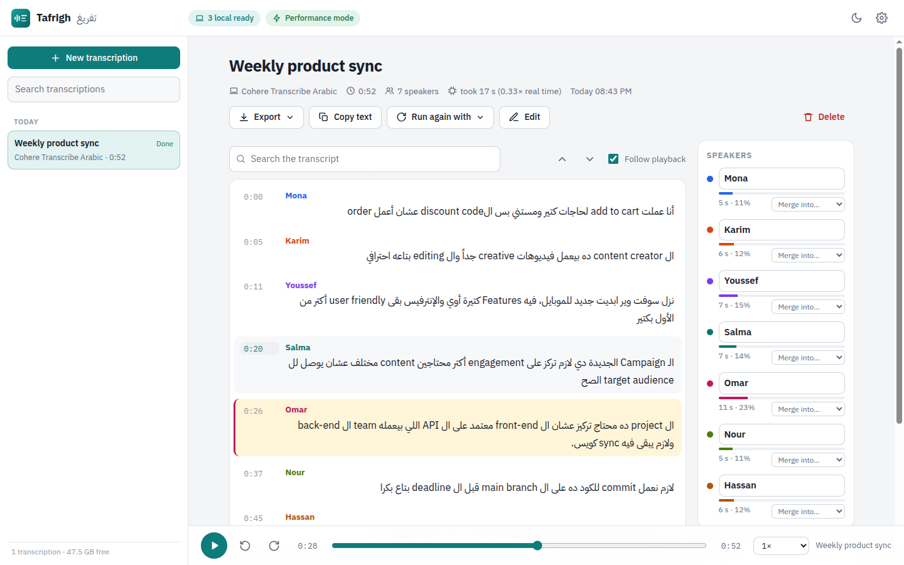
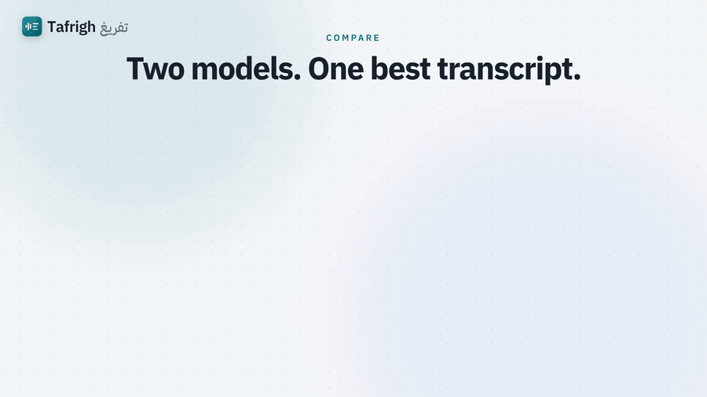
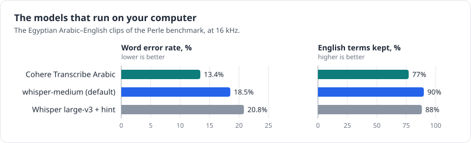
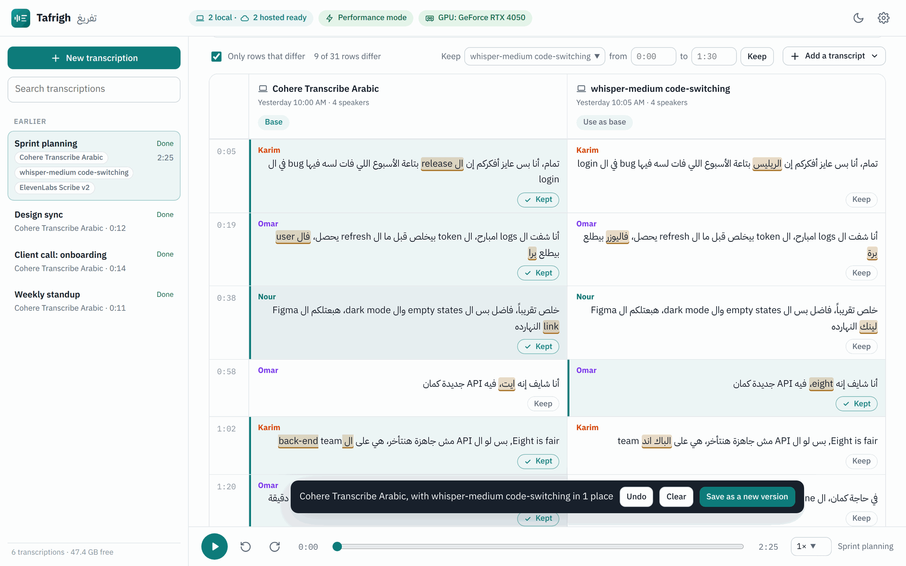
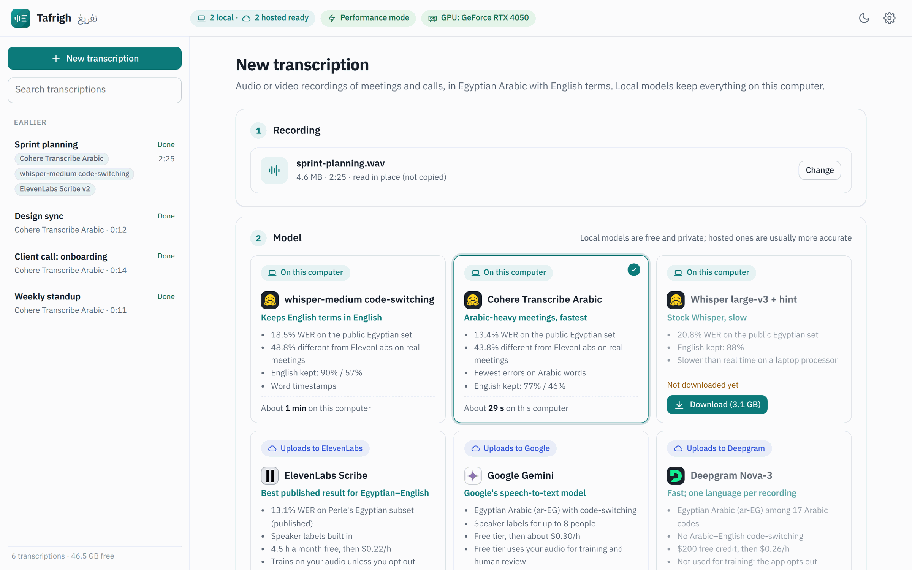
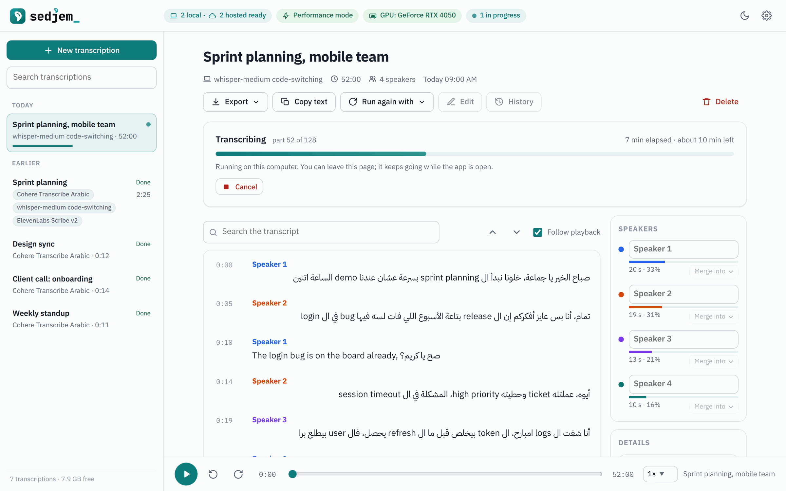
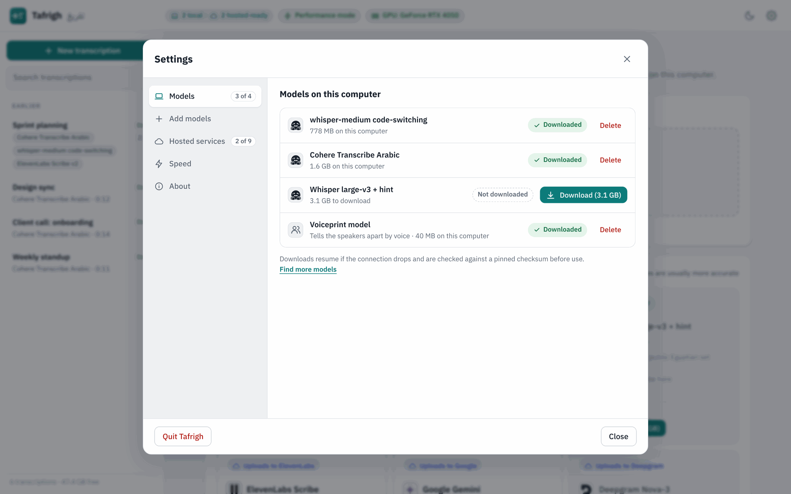
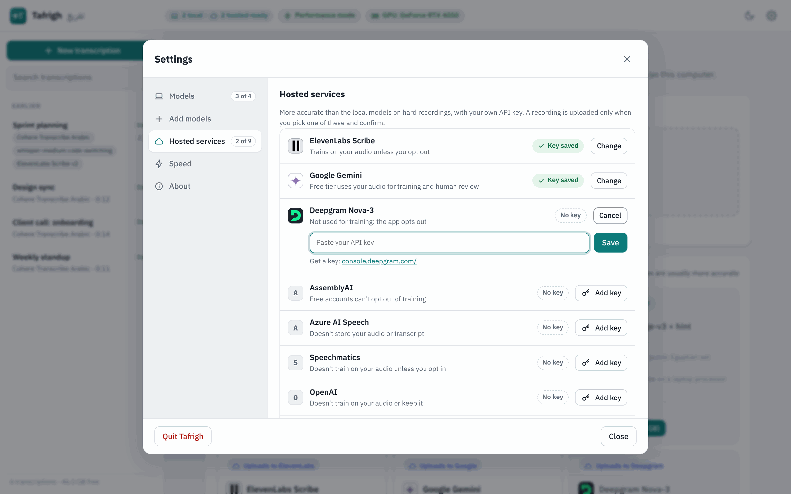
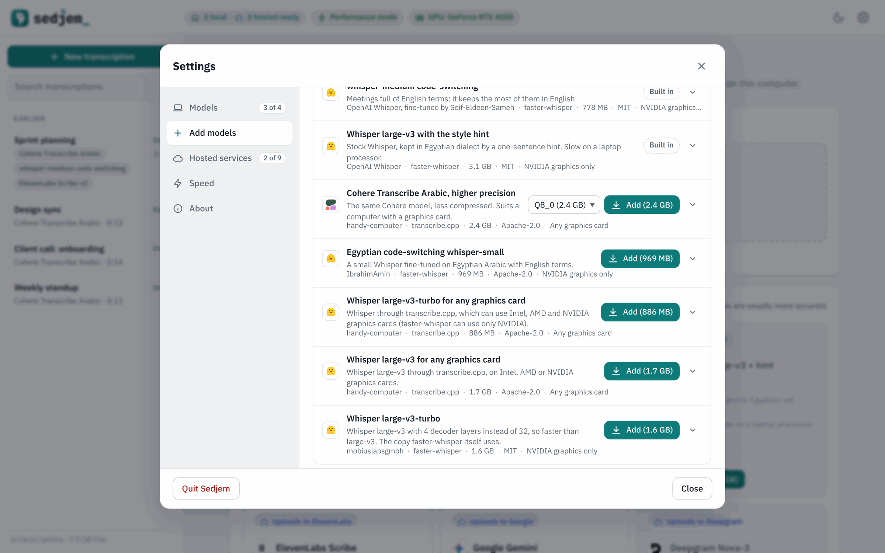
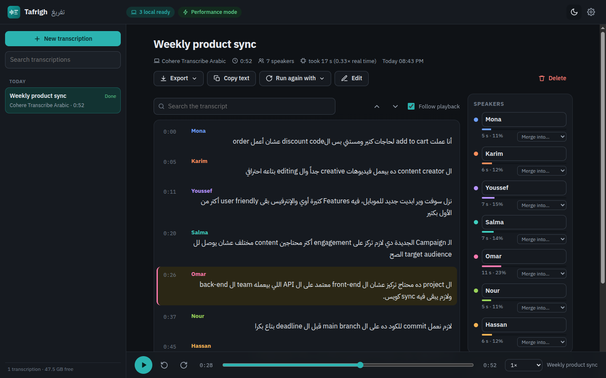

<p align="center">
  
</p>

<h1 align="center">Tafrigh <sub>تفريغ</sub></h1>

<p align="center">
  Transcripts of Egyptian Arabic–English meetings and calls, made on your own computer,<br>
  with each speaker told apart by voice.
</p>

<p align="center">
  
  
  
</p>

<p align="center">
  <!-- The hero is always the light screenshot. To follow the reader's theme instead, move this line inside the
       <picture> below: <source media="(prefers-color-scheme: dark)" srcset="docs/images/transcript-dark.png">
       (or use transcript-dark.png as the img to always show the dark one). -->
  <picture>
    
  </picture>
</p>

Egyptian tech teams talk in Arabic sentences full of English words: *deadline*, *sprint*,
*merge request*. Many speech-to-text models handle this badly. Some write the English words in
Arabic letters (on the Egyptian test set, several kept only 8–25% of them in Latin script), others
turn Egyptian speech into formal Arabic. Tafrigh (Arabic for writing out a recording) runs models
that were measured to do better, labels who said what by listening to their voices, and keeps the
recording on your machine unless you choose a hosted service.

<p align="center">
  <a href="docs/video/tafrigh-tech.mp4"></a>
</p>

<p align="center"><a href="docs/video/tafrigh-tech.mp4">Watch the 60-second video</a> (1920 x 1080, with music; <a href="docs/video/tafrigh-bright.mp4">another soundtrack</a>). Its source is in <a href="docs/video/">docs/video/</a>.</p>

## What it does

### Transcribe

- Opens audio or video recordings (mp3, m4a, wav, ogg, flac, mp4, mkv, webm and more), dropped in,
  chosen, or read in place from a path on the computer.
- Runs three models on your computer: Cohere Transcribe Arabic, a whisper-medium fine-tune for
  Arabic–English code-switching, and Whisper large-v3 with an Egyptian style hint.
- Labels speakers by their voiceprints. Give the number of people, or let it estimate.
- Or sends the recording to one of nine hosted services with your own API key: ElevenLabs,
  Speechmatics, Google Gemini, Deepgram, AssemblyAI, Azure AI Speech, OpenAI, Groq and Mistral.
  A recording is uploaded only after you tick the box that allows it, every time.
- Uses a graphics card when one works: Cohere through Vulkan on any GPU, Whisper through CUDA on
  NVIDIA cards. Without one it runs on the processor.
- Shows the transcript as it is written, with the time left, and can be cancelled at any time.

### Read, correct and export

- Plays the audio in step with the text. Click a line to hear it, search, rename or merge speakers,
  and correct lines by hand.
- Lays out each line in its own direction, so an Arabic line that starts with an English word still
  reads right to left.
- Exports plain text, SRT or WebVTT subtitles, Markdown or JSON, through a save dialog in the
  desktop app.
- Keeps the details of every run with its transcript: the model, the recording, the computer and
  the speed, with the makers' logos next to the hardware and the system. The exports carry them too.

### Keep versions, compare models

- Keeps a history for every transcript. Version 0 is what the model wrote and never changes. Each
  edit session is shown as a diff, the way `git diff` shows one, and saved as a new version with an
  optional message. Any version can be viewed, exported or restored.
- Groups the transcripts of one recording made with different models, whether with *Run again with*
  or by adding the same file twice.
- Compares them side by side, with the words that differ marked, and combines the best parts: keep
  a row or a time range from another model, review the result as a diff, and save it as a new
  version.

### Models and settings

- Adds models from a Hugging Face link, or with one click from a Recommended list that gives the
  evidence, size, licence and graphics cards for each.
- Settings has tabs for Models, Add models, Hosted services, Speed and About.
- Downloads resume if the connection drops and are checked against pinned checksums.
- Has a dark theme, and contacts nothing on the internet except the model downloads and the hosted
  services you choose.

## Models

| Model | Runs on | Word error rate, Egyptian test set | English terms kept in English | One hour of audio takes |
|---|---|---|---|---|
| Cohere Transcribe Arabic | your computer | 13.4% | 77% | about 20 min |
| whisper-medium code-switching (default) | your computer | 18.5% | 90% | 30–45 min |
| Whisper large-v3 with an Egyptian style hint | your computer | 20.8% | 88% | about 2 h |
| ElevenLabs Scribe v2 | ElevenLabs | 13.1% (published) | not measured | not measured |



*The three local models from the table: Cohere makes the fewest errors, whisper-medium keeps the most English terms in English.*

The test set is 40 Egyptian Arabic–English clips from the public
[Perle](https://huggingface.co/datasets/Perle-ai/ASR_Code_Switch) benchmark. Times were measured on
the project's test laptop, with an Intel Core i5-1245U and no NVIDIA GPU (details in
[the results](docs/03-results.md)); other computers will differ. ElevenLabs' figure comes from
[Perle's paper](https://arxiv.org/abs/2605.19069), on its own clips, so it can't be compared
directly with the project's.

Real meetings are much harder than the benchmark. On an hour of real work meetings with two to five
people, the local models' text differed from ElevenLabs' transcripts on 44% (Cohere) and 49%
(whisper-medium) of the words, mostly because they drop or misspell short English terms in fast
exchanges. Speaker labels did better: in meetings of two or three people, 8–9% of words went to
the wrong person, against 6% for ElevenLabs' own labels. Treat the local transcripts as private
drafts. For minutes that people will rely on, a hosted model is still more accurate. The method and
every number are in [the results](docs/03-results.md).

### Hosted services

Each one needs your own API key, entered in *Settings → Hosted services*. Apart from ElevenLabs'
published figure, none of them has been measured on Egyptian speech by the project.

| Service | Model the app uses | Arabic–English | Speaker labels |
|---|---|---|---|
| ElevenLabs | Scribe v2 | code-switching, the best published result | built in |
| Speechmatics | Arabic–English bilingual pack | code-switching | built in |
| Google Gemini | Gemini 3.5 Transcribe | code-switching | built in |
| AssemblyAI | Universal-3.5 Pro | code-switching | built in |
| OpenAI | gpt-transcribe, or gpt-4o-transcribe-diarize for labels | told to expect both | built in |
| Groq | Whisper large-v3 with the Egyptian hint | like the local Whisper large-v3 | from voiceprints on your computer |
| Mistral | Voxtral Mini Transcribe 2 | detects the language | built in |
| Deepgram | Nova-3, `ar-EG` | one language per recording | built in |
| Azure AI Speech | fast transcription, `ar-EG` | one language per recording | built in |

Prices, free tiers, what each service keeps and whether it trains on your audio are in
[the app notes](docs/09-app.md#the-models-and-their-settings).

## Screenshots

<p align="center">
  
</p>
<p align="center"><i>Two models on the same recording, side by side. Keep the rows each one got right and save the result as a new version.</i></p>

<table>
  <tr>
    <td width="50%"></td>
    <td width="50%"></td>
  </tr>
  <tr>
    <td>Every edit session is reviewed as a diff before it is saved.</td>
    <td>The history keeps the model's output as version 0 and every change after it.</td>
  </tr>
  <tr>
    <td></td>
    <td></td>
  </tr>
  <tr>
    <td>Pick a recording and a model. Each card lists what that model is good at.</td>
    <td>The lines appear while the model works. Cancel at any time.</td>
  </tr>
  <tr>
    <td></td>
    <td></td>
  </tr>
  <tr>
    <td>Download or remove the local models.</td>
    <td>Add a key for a hosted service. Each form opens only when asked.</td>
  </tr>
  <tr>
    <td></td>
    <td></td>
  </tr>
  <tr>
    <td>More models for these meetings, added in one click.</td>
    <td>Dark theme.</td>
  </tr>
</table>

The transcripts in the screenshots are made up, and so are the names.

## Install

### Windows

There is no signed release yet. The installer (per user, no admin rights, 77 MB) is built by this
repository's [Desktop build workflow](https://github.com/MohammedEl-sayedAhmed/arabic-stt/actions/workflows/desktop.yml):
open the latest successful run and download `Tafrigh-windows-setup`. GitHub asks you to sign in
for this, and keeps each build for 7 days. Windows SmartScreen will warn about an unknown publisher;
choose *More info*, then *Run anyway*. To build the installer yourself, see
[the desktop notes](docs/10-desktop.md#build-it).

### Linux, or from source

You need Python 3.12 and [uv](https://docs.astral.sh/uv/).

```sh
git clone https://github.com/MohammedEl-sayedAhmed/arabic-stt.git
cd arabic-stt
uv venv .venv --python 3.12
VIRTUAL_ENV=.venv uv pip install -r requirements.txt
./app.sh              # opens Tafrigh at http://127.0.0.1:8765
./app.sh --desktop    # or in a window of its own
```

On Windows, run `app.cmd` after the setup in [the desktop notes](docs/10-desktop.md#run-it).

On first start, open *Settings → Models* and download whisper-medium (778 MB) or
Cohere (1.6 GB). The voiceprint model for speaker labels (40 MB) comes with the first one.

### The desktop app

The desktop app opens Tafrigh in a native window (Edge WebView2 on Windows, GTK WebKit or Qt on
Linux) with native open and save dialogs. Where that isn't available it uses an app-mode browser
window, then a browser tab. `--browser` goes straight to the browser window, and `--server` runs only
the server, for any browser to use. The details are in [the desktop notes](docs/10-desktop.md).

## How it works

The recording is cut at pauses (Silero VAD) into pieces of up to 25 seconds, and each piece goes to
the speech model. Separately, a voiceprint model (NVIDIA TitaNet-small) describes what the voice
sounds like every 0.75 seconds, and spectral clustering groups those voiceprints into speakers.
Whisper gives every word a time, so each word gets the speaker whose voice is heard at that
moment; for Cohere, which gives no word times, the pieces are cut where the voice changes.
It all runs on the processor, or on a graphics card when one works.

The app is a small Python web server bound to 127.0.0.1 with a plain HTML and JavaScript interface.
The desktop version shows the same interface in a native window and is packaged with PyInstaller.
Your transcriptions, their versions, audio copies and API keys stay in the app's data folder.

## Command line

The same pipeline works without the app:

```sh
.venv/bin/python transcribe.py meeting.m4a --speakers 3        # or --speakers 0 to estimate
.venv/bin/python transcribe.py call.wav --engine cohere --speakers 2
```

It prints the transcript and saves it, with timings and speakers, as text and JSON. Setup, options
and speeds are in [the command-line notes](docs/05-command-line.md).

## Background

Tafrigh came out of a search for speech-to-text models that handle Egyptian Arabic–English meetings
on an ordinary laptop. Open models were measured on public Egyptian code-switching test sets and on
real work meetings, and Tafrigh runs the ones that did best. R2T2, the model the search started from,
was tried first and is not usable for this: it wrote most English terms in Arabic letters. The
[project notes](docs/README.md) have the whole story:

| | |
|---|---|
| [Use case](docs/01-use-case.md) | the recordings, the test audio and the original question |
| [Trials and issues](docs/02-trials-and-issues.md) | every experiment in order, what broke and how it was fixed |
| [Results](docs/03-results.md) | method, public benchmark, phone audio, real meetings, caveats |
| [Speaker labels](docs/04-speaker-labels.md) | how voices are told apart, and five voiceprint models compared |
| [Command line](docs/05-command-line.md) | setup, options, speed and memory |
| [Market research](docs/06-market-research.md) | hosted services and open models, free tiers, privacy terms |
| [Recommendation](docs/07-recommendation.md) | what to use for which job |
| [Disk space and cleanup](docs/08-disk-and-cleanup.md) | what gets installed where, and how to remove it |
| [The app](docs/09-app.md) | using Tafrigh, versions, comparing, its settings, API keys, privacy |
| [Desktop app](docs/10-desktop.md) | running, building and testing on Windows and Linux |

## Thanks

Tafrigh stands on other people's work: the
[whisper-medium Arabic–English code-switching fine-tune](https://huggingface.co/Seif-Eldeen-Sameh/whisper-medium-arabic-codeswitched-ct2),
Cohere Transcribe Arabic (the
[GGUF build](https://huggingface.co/handy-computer/cohere-transcribe-arabic-07-2026-gguf) from
handy-computer, run with transcribe.cpp), OpenAI Whisper through
[faster-whisper](https://github.com/SYSTRAN/faster-whisper) and CTranslate2,
[sherpa-onnx](https://github.com/k2-fsa/sherpa-onnx) with NVIDIA TitaNet, Silero VAD, PyAV,
[pywebview](https://pywebview.flowrl.com/), PyInstaller and Inno Setup. The benchmark uses the
[Perle](https://huggingface.co/datasets/Perle-ai/ASR_Code_Switch) and ArzEn test sets.

## Licence

Tafrigh is made by Mohammed El-sayed Ahmed and is free software under the
[GNU Affero General Public License v3.0](LICENSE) (AGPL-3.0-only). You can use, study, change and
share it. If you distribute a modified version, or run one as a service for others, you must publish
its source under the same licence, and keep the author credit in its About section and README (the
[NOTICE](NOTICE) file has the exact terms). Versions published up to 25 September 2026 were under the
MIT licence.

For use without these conditions, for example inside a closed-source product, commercial licences
are available from the author: contact [Mohammed El-sayed Ahmed](https://github.com/MohammedEl-sayedAhmed).
Contributions are welcome; by sending one you agree that it may be distributed under both the AGPL
and the commercial licence.

The models keep their own licences: the whisper-medium fine-tune and Whisper large-v3 are MIT (check
the fine-tune's card for its training data), Cohere Transcribe Arabic and the Whisper tokenizer are
Apache-2.0, and NVIDIA TitaNet through sherpa-onnx is CC-BY-4.0. The desktop build bundles
third-party packages under their own licences, including the FFmpeg libraries that come with PyAV
(LGPL). The hosted services are used under their own terms. The logos in the app come
from [Simple Icons](https://simpleicons.org) (CC0). The trademarks belong to their owners, and the
logos are shown only to identify the hardware, systems, models and services the app names.
