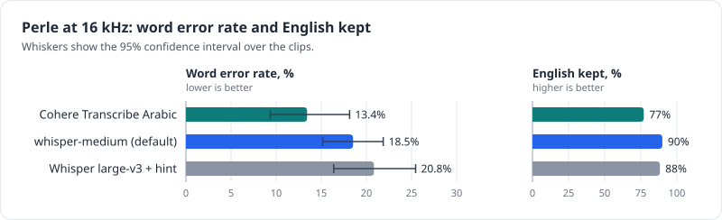
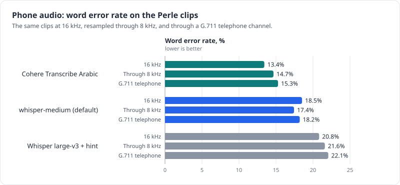
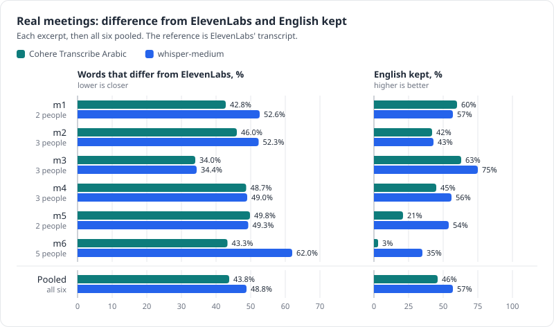
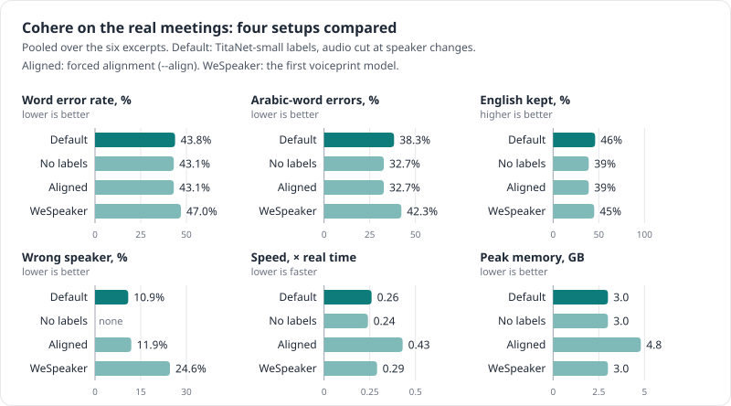

# Results

The question is how well each model transcribes Egyptian Arabic–English meetings and calls. The
evidence comes first from Perle, the public test set closest to those meetings, and from six real
work meetings; ArzEn's conversations come next, with a caveat about training data. The models that
were also tried and are not usable for this (R2T2, Qwen3-ASR and Audar) come last in each table.

Everything was measured on 24 and 25 September 2026 on one test laptop: a Lenovo ThinkPad L14 Gen 3
with a 12th Gen Intel Core i5-1245U (10 cores, 12 threads), 16 GB of RAM and Intel Iris Xe
integrated graphics, no NVIDIA GPU, running Kubuntu 24.04. The models ran on its CPU in the
performance power mode unless noted. Speeds on other computers will differ. The generated tables
are in [results-tables.md](results-tables.md), and the per-clip outputs in `results/*.jsonl`, each
with a `.meta.json` that records its settings.

## Method

### Test sets

The public sets were downloaded, never uploaded. The clips used are pinned in `bench/samples/`.

| Set | What | Clips | Notes |
|---|---|---|---|
| Perle (`Perle-ai/ASR_Code_Switch`, Egyptian rows) | Egyptian Arabic–English sentences about tech, work and daily life | 40 random (seed 42), 4.3 min, 648 reference words | The closest to the target meetings, and the main public test. Taken from the dataset's only split, *train*, and published in May 2026, so models released later may have trained on it |
| Real meetings | 10-minute excerpts of 6 real work meetings, with ElevenLabs references | 60 min | The in-domain test, described [below](#real-meetings) |
| ArzEn (validation split) | Egyptian Arabic–English conversational interviews | 40 random, 6.5 min (37 contain English words; 3 are Arabic apart from tags like `[HES]`) | Conversational Egyptian. Several Arabic fine-tunes were trained on it ([below](#arzen-conversations)) |
| The test call | a 2-minute 8 kHz call with 2 speakers, no reference | 1 | Judged by reading |

Every public clip was run in three audio conditions: `wav16k` (the original at 16 kHz), `phone`
(resampled through 8 kHz, like the test calls) and `g711` (a telephone channel: a 300–3400 Hz
band-pass and G.711 μ-law coding at 8 kHz).

### Pipeline

Unless a row is marked *whole clip*, each clip went through exactly what `transcribe.py` does. Silero
VAD cuts it at pauses into chunks of at most 25 s, each chunk gets 0.5 s of silence at the end, and
Whisper decodes with word timestamps and gap-fill. The first round passed the whole clip to the
model instead; those are the *whole clip* rows. R2T2 and Qwen3-ASR were only measured that way,
before their model files were deleted. So was Audar, because it was not pursued further (its files
are still in `models/`).

### Scoring

`bench/score.py` normalizes the reference and the output in the same way. It removes ArzEn's event
tags, brackets and joiners; strips Arabic diacritics and tatweel; unifies the alef forms (أ إ آ to
ا), ى to ي and ة to ه; turns Arabic-Indic digits into 0–9; removes punctuation; splits Arabic from
Latin letters written together (`الdata` becomes `ال data`); and lowercases. Then it computes:

- WER and CER, the word and character error rates over the set. WER comes with a 95% bootstrap
  confidence interval over clips.
- Arabic-word and English-word errors: substitutions and deletions of reference words in each
  script, divided by the number of reference words in that script. Insertions are not counted, so
  the two don't add up to the WER. An Arabic prefix written onto an English word (`الـdiscount`)
  counts with the English word, so spelling the term in Arabic letters is an English error.
- English kept: the share of the reference's English words that appear in the output in Latin
  script. Writing `database` as `داتابيس` counts as a miss.
- Speed: processing time divided by the length of the audio. 0.36 is about 3 times faster than real
  time; 2.0 takes twice as long as the audio. For public clips, the 0.5 s of added silence is not
  counted. For meetings and calls run through `transcribe.py`, the whole recording counts, pauses
  included, so those figures are lower than the same model's on short clips. Some runs shared the
  CPU with other work, which inflates their figure; they are marked.

## Public benchmark: Perle at 16 kHz

| Model | WER (95% CI) | CER | Arabic-word errors | English-word errors | English kept | Speed |
|---|---|---|---|---|---|---|
| Cohere Transcribe Arabic (Q4, transcribe.cpp) | 13.4% (9–18) | 8.2% | 5.1% | 24% | 77% | 0.36 |
| whisper-medium code-switching fine-tune (default) | 18.5% (15–22) | 7.1% | 17.8% | 11% | 90% | 1.08 |
| Whisper large-v3 + style hint | 20.8% (16–25) | 8.3% | 17.8% | 17% | 88% | 2.15 |
| Whisper large-v3 *(whole clip)* | 39.7% (34–45) | 29.0% | 15.2% | 76% | 25% | 1.52 |

*The three models Tafrigh runs, from the table: bars are the word error rate, whiskers its 95% confidence interval.*

Paired over the same 40 clips (bootstrap), Cohere minus whisper-medium is −5.1 points (95% CI
−10.9 to +0.8), and whisper-medium minus large-v3 with the hint is −2.3 (−7.3 to +2.2). With 648
reference words, neither gap in overall WER is proven. Two things are clear in every condition:
Cohere makes about a third as many errors on Arabic words, and whisper-medium keeps far more
English terms in English (87–90% against 72–77%).

### On a graphics card

Cohere on the test laptop's integrated Intel Iris Xe, through transcribe.cpp's Vulkan backend, gave
exactly the same text as on the CPU for all 40 Perle clips, so the same 13.4%, at 0.15 times real
time instead of 0.36 (performance mode). On a 50-second clip in power-saver mode the gap was wider:
0.14 against 0.60. The Whisper models can't use this GPU: CTranslate2 only runs on NVIDIA GPUs.

*Speed on the test laptop, lower is faster: Cohere on the integrated GPU and on the CPU next to the other two models on the Perle clips, and the meeting excerpts with speaker labels (mean and range).*

### Also tried

These three were measured in the first round, with the whole clip given to the model, and are not
usable for this: they hear the English words but write most of them in Arabic letters.

| Model | WER (95% CI) | CER | Arabic-word errors | English-word errors | English kept | Speed |
|---|---|---|---|---|---|---|
| Audar-ASR-V1-Turbo *(whole clip)* | 43.5% (39–49) | 33.2% | 12.9% | 86% | 12% | 0.63 |
| R2T2 *(whole clip)* | 47.1% (41–52) | 30.1% | 25.1% | 77% | 25% | 0.82 |
| Qwen3-ASR-1.7B *(whole clip)* | 50.6% (46–55) | 35.0% | 21.8% | 91% | 8% | 0.75 |

## Phone audio

| Model | 16 kHz | Through 8 kHz | G.711 telephone | English kept (G.711) |
|---|---|---|---|---|
| Cohere Transcribe Arabic | 13.4% | 14.7% | 15.3% | 72% |
| whisper-medium code-switching | 18.5% | 17.4% | 18.2% | 87% |
| Whisper large-v3 + hint | 20.8% | 21.6% | 22.1% | 87% |

*Each model's three bars are nearly the same length: phone-band audio moves the word error rate by at most about 2 points.*

Phone-band audio and μ-law coding cost these three models at most about 2 WER points, which is
within the noise. In the whole-clip round, 8 kHz cost 1.2–4.3 points (large-v3 with the hint on
ArzEn went from 33.7% to 38.0%). Real calls add noise, packet loss and crosstalk that this
simulation leaves out.

## Real meetings

The test used the first 10 minutes of one recording from each of the 6 meetings (60 minutes in all,
with 2–5 people speaking in each excerpt), scored against the verbatim ElevenLabs transcript with
speakers corrected by hand. The scripts are `bench/prepare_private_meetings.py` and
`bench/score_meetings.py`; the audio, transcripts and per-excerpt outputs stay in the git-ignored
`data/` and `results/meetings/`. The reference is machine output too, so WER here means
disagreement with ElevenLabs. The transcripts have no timestamps, so the reference is cut where it
lines up best with the excerpt. The lenient score also drops pure hesitation sounds (آآآ, مم) and
unifies common Egyptian spellings (كده/كدا, ايوه/ايوا) on both sides.

Both engines ran with speaker labels and the true number of speakers. Cohere used TitaNet-small
voiceprints, the current default. whisper-medium was run with the first voiceprint model, WeSpeaker
ResNet34. Its text does not depend on the speaker step, so its speaker numbers below are
TitaNet-small relabellings of the same words (`bench/compare_voiceprints.py`).

| Excerpt | People | Cohere WER (lenient) | whisper-medium WER (lenient) | English kept, C / W | Wrong speaker, C / W | ElevenLabs' own labels |
|---|---|---|---|---|---|---|
| m1 | 2 | 42.8% (41.2%) | 52.6% (51.2%) | 60% / 57% | 3.1% / 4.6% | 0.0% |
| m2 | 3 | 46.0% (44.9%) | 52.3% (51.2%) | 42% / 43% | 5.0% / 7.8% | 0.0% |
| m3 | 3 | 34.0% (30.9%) | 34.4% (31.5%) | 63% / 75% | 11.2% / 10.4% | 0.3% |
| m4 | 3 | 48.7% (46.8%) | 49.0% (47.9%) | 45% / 56% | 1.7% / 2.6% | 0.5% |
| m5 | 2 | 49.8% (48.4%) | 49.3% (48.2%) | 21% / 54% | 17.1% / 16.5% | 27.2% |
| m6 | 5 | 43.3% (41.2%) | 62.0% (60.6%) | 3% / 35% | 37.6% / 38.4% | 12.0% |
| pooled | | 43.8% (42.1%) | 48.8% (47.3%) | 46% / 57% | 10.9% / 11.7% | 6.5% |

*The strict word error rate against ElevenLabs and the English kept, per excerpt and pooled; the lenient scores and the speaker labels are in the table, and the speaker labels also in [their own chart](04-speaker-labels.md#accuracy-on-real-meetings).*

Pooled values are totals over all excerpts; for English kept, the English words kept in all
excerpts divided by the English words in all excerpts. The excerpts differ in how much English they
contain, from 24% of the reference words (m3) down to 6% (m6, which has only 31 English words, so
its 3% and 35% rest on 1 and 11 words).

Other pooled numbers, Cohere and then whisper-medium: CER 29.9% and 29.4%; errors on Arabic words
38.3% and 45.4%; speed with speaker labels 0.15–0.32 times real time (mean 0.26) and 0.30–0.79
(mean 0.53); peak memory 3.0 GB and 2.1–3.3 GB. The whisper-medium speed and memory come from its
WeSpeaker run. TitaNet-small's voiceprint step is faster, so with the default it is slightly quicker
still.

### Variations on Cohere

| Cohere setup, pooled over the six excerpts | WER (lenient) | Arabic-word errors | English kept | Wrong speaker | Speed | Peak memory |
|---|---|---|---|---|---|---|
| TitaNet-small labels, audio cut at speaker changes (the default) | 43.8% (42.1%) | 38.3% | 46% | 10.9% | 0.26 | 3.0 GB |
| No speaker labels | 43.1% (41.4%) | 32.7% | 39% | | 0.24 | 3.0 GB |
| TitaNet-small labels on forced-aligned words (`--align`, experimental) | 43.1% (41.4%) | 32.7% | 39% | 11.9% | 0.43 | 4.8 GB |
| First voiceprint model (WeSpeaker ResNet34), cut at speaker changes | 47.0% (45.2%) | 42.3% | 45% | 24.6% | 0.29 | 3.0 GB |

*One small chart per column of the table, with the default in the darker teal; without speaker labels there is no wrong-speaker figure.*

Cutting the audio at speaker changes costs Cohere under a point of WER and raises its errors on
Arabic words, but on these meetings it kept more English terms in Latin script that way (46% against
39%). Forced alignment (see [speaker labels](04-speaker-labels.md#forced-alignment-experimental))
keeps the unlabelled text, and with it the better Arabic, and puts slightly more words on the wrong
speaker. It takes two-thirds more time and 1.8 GB more memory. Per excerpt, the aligned labels put
4.5%, 7.7%, 9.7%, 9.5%, 16.0% and 36.5% of words on the wrong speaker (m1 to m6), and the aligned
WER was 40.2%, 43.0%, 33.5%, 50.7%, 54.4% and 37.5%. The WeSpeaker voiceprints made so many false
speaker changes that they cut the audio into fragments, which is why that row is 3–4 points worse.

### What the meeting numbers show

Real meetings are far harder than the public benchmark. The same two models that reach 13–18% on
Perle disagree with ElevenLabs on 44–49% of the words here. The speech is spontaneous, people talk
over each other, there are more of them, and English terms go by fast.

Cohere is ahead on the text (43.8% against 48.8%, lower on 3 excerpts and level on 3), makes fewer
errors on Arabic words, and is twice as fast. whisper-medium keeps English in English better: 57%
against 46% pooled, 75% against 63% on m3 (the excerpt with the most English), and the widest gap on
m5 (54% against 21%). On m1, the one excerpt with long English stretches, the two were level (Cohere
60%, whisper-medium 57%).

The disagreements look like local errors. Judging from the text alone, since the audio was not
listened to, most differences in three spot-checked stretches were the local model dropping or
misspelling short English words and phrases (writing them in Arabic letters or leaving them out),
dropping whole phrases in fast exchanges, or turning Egyptian greetings into formal Arabic. The
words ElevenLabs has and the local models lack are coherent and fit the context. A human-checked
excerpt would show how much of the gap is ElevenLabs' own error.

Speaker labels are good on most meetings of two or three people: 2–11% of words go to the wrong
person on four of the five, 17% on m5 (2 people, where ElevenLabs' raw labels are 27% off) and 38%
on the 5-person meeting. Pooled over the five 2–3-person excerpts that is 8.2% for Cohere and 9.0%
for whisper-medium, against 5.9% for ElevenLabs' raw labels. Over all six, ElevenLabs' raw labels
differ from the hand corrections on 6.5% of words, and that comparison favours ElevenLabs, since the
corrections started from its labels.

## ArzEn conversations

ArzEn's clips are interviews in Egyptian Arabic with English mixed in, closer to a conversation than
Perle's sentences. The two leading models were almost certainly trained on it, so these numbers
flatter them: both score far better here than on Perle, while stock Whisper large-v3 with the hint
goes the other way (see [the caveats](#caveats)).

| Model | WER (95% CI) | CER | Arabic-word errors | English-word errors | English kept | Speed |
|---|---|---|---|---|---|---|
| Cohere Transcribe Arabic (Q4, transcribe.cpp) | 6.7% (4–10) | 3.0% | 5.3% | 3% | 96% | 0.31 |
| whisper-medium code-switching fine-tune (default) | 10.8% (8–13) | 4.7% | 9.0% | 8% | 95% | 0.70 |
| Whisper large-v3 + style hint | 35.7% (31–41) | 20.2% | 30.2% | 47% | 55% | 1.41 |

Also tried, with the whole clip: Audar at 18.9%, which was almost certainly trained on ArzEn too,
and Qwen3-ASR and R2T2 at 43.2% and 43.9% at their best settings. Every row is in
[the result tables](results-tables.md).

## The test call

The 2-minute call has no reference transcript, so the outputs were read side by side. The files are
in `results/poc/` and stay local; the call's content is not in this repository.

After the fixes (`results/poc/after-fixes/`, TitaNet-small voiceprints):

| Model | Words, plain / with speaker labels | Speed, plain / with labels |
|---|---|---|
| whisper-medium code-switching | 310 / 310 | 0.57× / 0.59× |
| Cohere Transcribe Arabic | 292 / 284 | 0.30× / 0.35× |

Both split the call 57 s and 44 s between the two speakers. The first-round readings, from before
the fixes:

| Model | Setting | Speed | Reading |
|---|---|---|---|
| whisper-medium code-switching | with speaker labels | 1.4× | The most complete, and it kept English tech terms in English best, including a tool name every other model missed. A few terms became similar-sounding English words and a few were spelled in Arabic letters |
| Cohere Transcribe Arabic | with speaker labels | 0.4× | Got two acronyms right that the others missed, but produced only 248 words because this run hit the speaker-path bug (fixed; now 284). On this hesitant speech it also added notes like `(تأتأة)` ("stutter"), which are now stripped automatically |
| Whisper large-v3 + hint | with speaker labels | 1.4× | Good. Missed an acronym, spelled a tool name in Arabic letters, and needed the gap-fill fix |
| R2T2 | no speaker labels | 1.8× (power-saver mode) | Clearly the worst: common tech words misheard as nonsense, dropped clauses, English almost always in Arabic letters |
| Qwen3-ASR-1.7B | no speaker labels | 1.4× (power-saver mode) | The same kinds of errors as R2T2, slightly more complete |

## A long recording

A 16-minute call with 2 speakers:

| Model | Speed | Peak memory | Notes |
|---|---|---|---|
| Cohere + speaker labels | 0.37× real time (6 min) | 3.1 GB | After the fixes, with the first voiceprint model (WeSpeaker ResNet34). Before them it crashed on this file: in one turn the decoder looped until its length cap. Such chunks are now split and retried |
| whisper-medium + speaker labels | 1.80× real time (29 min) | 2.9 GB | Before the fixes. On the meeting excerpts after the fixes it ran at 0.30–0.79× (keeping only the first decoding window roughly halved its work) |

## What the numbers say

1. The Arabic-specialised models win by a wide margin. Cohere Transcribe Arabic has the lowest WER,
   on the public set and on the meetings, by far the fewest errors on Arabic words, and runs about
   3–4 times faster than real time on the test laptop's CPU. The whisper-medium fine-tune keeps
   English terms in English best: 90% on Perle and 57% on the meetings, against Cohere's 77% and
   46%.
2. On real meetings both remain far from ElevenLabs (44–49% of words differ), while their speaker
   labels come within a few points of ElevenLabs' own on meetings of two or three people (8–9% of
   words on the wrong person against 6%, pooled).
3. A one-sentence style hint fixes stock Whisper large-v3: 39.7% to 22.4% on Perle and 47.4% to
   33.7% on ArzEn (whole clip, without and with the hint; `results/summary.json`, config
   `ar-prompt-clip`). With the current pipeline it scores 20.8% and 35.7%. That helps where only
   stock Whisper is available, for example hosted Whisper on Groq.
4. Keeping English in Latin letters is what separates the models. The Qwen3-ASR family that was
   also tried (R2T2, Qwen3-ASR and Audar) hears the English words but, on Perle, spells them in
   Arabic letters. Audar has good Arabic (12.9% errors) but keeps only 12% of English words in Latin
   script.
5. R2T2, where the project started, is not a fit, and that is now measured rather than inferred
   from its training data. It is one of the two least accurate models on every test: 47.1% on
   Perle; 43.9% at its best ArzEn setting, just behind its base model's best of 43.2%; and clearly
   the worst on the call. It is no better than Qwen3-ASR on Arabic, much worse when left to detect
   the language (60.1% on ArzEn), writes most English terms in Arabic letters, and the context hint
   does not help it.

## Caveats

- Training-data contamination. On ArzEn, Cohere scores 6.7% (19 of 40 clips exactly right),
  whisper-medium 10.8% and Audar 18.9%, far better than on Perle (13.4%, 18.5% and 43.5%), while
  stock large-v3 with the hint goes the other way (35.7% against 20.8%). Audar even reproduces
  ArzEn's own `[LAUGHTER]` tag in every clip whose reference has one, and keeps 76% of English words
  on ArzEn against 12% on Perle. All three were almost certainly trained on ArzEn, so ArzEn is not
  evidence for them. Perle may be contaminated too, since it is a *train* split. The real meetings
  are not.
- Small samples. With 40 clips per set, differences under about 5 points are mostly within the
  confidence intervals.
- Speed varies with whatever else the test laptop is doing, and power-saver mode is several times
  slower. Whisper large-v3's first run on the call (no hint, no speaker labels) took 6.4 times real
  time in power-saver mode, while later performance-mode runs with the hint and speaker labels,
  which is more work, took 1.4–2.4 times. That puts the slowdown at roughly 3–5 times, from a single
  run with different settings.
- The models were quantized (Q4, Q8, int8). Full-precision versions may be slightly better.
- ElevenLabs' published 13.1% (Perle paper, Egyptian subset) uses different clips and
  normalization, so it can't be compared directly with the local models' numbers in the project's
  tests.
