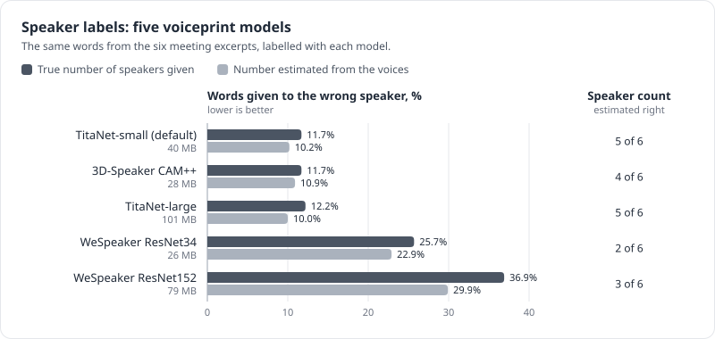
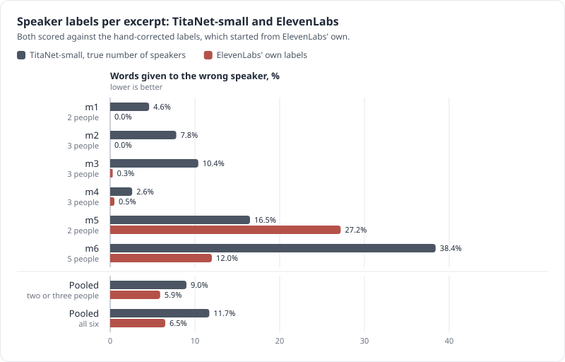

# Speaker labels

None of the speech-to-text models in the project's tests label speakers, so telling speakers apart
(diarization) is a separate step that runs locally, in `speakers.py`.

## How it works

1. Find the speech. Silero VAD marks where anyone is talking.
2. Take voiceprints. A 1.5-second window slides over the speech every 0.75 s. On very long
   recordings the step grows so that there are at most 2,000 windows; if many short turns still
   exceed that, an evenly spaced subset is clustered and every other window joins the nearest
   speaker. For each window a speaker-embedding model, by default NVIDIA TitaNet-small (40 MB,
   trained with telephone speech among other data), produces a voiceprint that captures timbre and
   pitch: what a voice sounds like, not what it says.
3. Group by voice. Spectral clustering (NME-SC, Park et al. 2019) groups the voiceprints into N
   speakers. The neighbour count is tuned for each recording, so a handful of odd windows (noise,
   crosstalk, laughter) can't become a speaker of their own. N comes from `--speakers N`, and
   `--speakers 0` estimates it from the eigengap.
4. Smooth. Within each speech segment, a window whose two neighbours agree with each other takes
   their speaker.
5. Attribute the text. Whisper returns a timestamp for every word, so each word goes to the speaker
   whose voice is active at that moment, and consecutive words from one speaker form a line. Cohere
   and the Qwen3-ASR family give no word timestamps. For them, every pause-delimited chunk is cut
   where the voice timeline changes speaker (snapped to the quietest 20 ms within ±0.3 s; pieces
   under 0.3 s join a neighbour), and each piece is transcribed and labelled. Either way, all the
   speech is transcribed. With `--align`, Cohere's words get times from forced alignment instead
   ([below](#forced-alignment-experimental)).

Everything runs on the CPU with sherpa-onnx and a small ONNX voiceprint model: no PyTorch, no
account, no upload. Speaker labels add a few seconds, about 2–3 s on the 2-minute test call
(whisper-medium took 68.4 s without them and 70.8 s with them). With TitaNet-small the voiceprints
take 4–8 s per 10-minute excerpt, plus the clustering. `--voiceprint-model` swaps in another model.

## What was tried, and what went wrong

| Version | Result | Problem |
|---|---|---|
| sherpa-onnx's built-in pipeline, counting speakers itself | 4 speakers on the test call (69 s, 49 s, 5 s, 2 s) | invented two tiny speakers |
| the same, told there were 2 | 111 s against 14 s | merged both real voices into Speaker 1; Whisper invented text for the fragments left to Speaker 2 |
| voiceprints and spectral clustering, first version | 57 s against 44 s, turns alternate | The code review found a bug: for the Cohere and llama engines, the speaker turns covered only the middle 0.75 s of each window, so 13–30% of the speech (up to about 46% on long calls, where the window step grows) was never transcribed. It also switched smoothing off on long recordings and misreported talk time |
| fixed version, WeSpeaker ResNet34 voiceprints | 58 s against 44 s on the test call; every sample of speech reaches the model | 25.7% of words credited to the wrong person on the meeting excerpts |
| current version, TitaNet-small voiceprints | | 11.7% wrong on the meeting excerpts; number of speakers estimated right in 5 of 6 |

The failure with 2 speakers is a known weakness of agglomerative clustering. When a few outlier
segments are further from everyone than the two real voices are from each other, the two voices
merge first.

## Accuracy on real meetings

This was measured on the six 10-minute meeting excerpts, with 2–5 people each (see
[the results](03-results.md#real-meetings)), as WDER: the share of words credited to the wrong
person. Our words are aligned to the hand-corrected ElevenLabs reference, and our Speaker 1, 2 and
so on are matched to the real people in the way that agrees best. `bench/compare_voiceprints.py`
relabels the same Whisper words with each voiceprint model, so only the speaker step differs.

| Voiceprint model | Size | Wrong speaker, true count given | Wrong speaker, count estimated (`--speakers 0`) | Count estimated right |
|---|---|---|---|---|
| TitaNet-small (default) | 40 MB | 11.7% | 10.2% | 5 of 6 |
| 3D-Speaker CAM++ (Chinese and English) | 28 MB | 11.7% | 10.9% | 4 of 6 |
| TitaNet-large | 101 MB | 12.2% | 10.0% | 5 of 6 |
| WeSpeaker ResNet34 (the first default) | 26 MB | 25.7% | 22.9% | 2 of 6 |
| WeSpeaker ResNet152 | 79 MB | 36.9% | 29.9% | 3 of 6 |



*Words credited to the wrong person with each voiceprint model, given the true number of speakers or estimating it; the right column counts the excerpts where the estimate was right.*

Per excerpt with TitaNet-small and the true count: 4.6% (2 people), 7.8%, 10.4% and 2.6% (3 people
each), 16.5% (2 people) and 38.4% (5 people).

For comparison, ElevenLabs' own raw labels differ from the hand corrections on 6.5% of the words
over the same stretches, and on 5.9% over the five 2–3-person excerpts, where TitaNet-small gets
9.0%. That comparison favours ElevenLabs, since the corrections started from its labels. With
TitaNet, the local labels come within a few points of ElevenLabs on meetings of two or three
people, and remain weak on larger meetings.



*Per excerpt, TitaNet-small against ElevenLabs' raw labels, both scored against the hand corrections; the ElevenLabs figures per excerpt are in [the results](03-results.md#real-meetings).*

The two voiceprint families trained on VoxCeleb (celebrity interviews) do worst, and the models
trained with telephone and large multi-speaker data (TitaNet, 3D-Speaker) do best, as the research
predicted. With TitaNet the estimate missed only on the 5-person excerpt. There it found fewer
speakers than were present (2 of 5 with TitaNet-small, 3 with TitaNet-large) and still scored better
than clustering into the true 5 (21.6% against 38.4%, and 16.0% against 41.0%). So on larger
meetings `--speakers 0` is a reasonable choice even when the headcount is known. The other models
also missed on 2–3-person excerpts, and not always by finding too few: CAM++ found 3 speakers for 2
people on one excerpt and scored worse there (19.0% against 17.0% with the true count).

## Forced alignment (experimental)

Cutting Cohere's audio at every speaker change means each piece is transcribed without the words
around it. The alternative is to transcribe the whole pause-delimited chunk and then find where each
word falls in the audio, which is what forced alignment does. `align.py` does this with
[ctc-forced-aligner](https://github.com/MahmoudAshraf97/ctc-forced-aligner) and the MMS-300m
forced-aligner model (`MahmoudAshraf/mms-300m-1130-forced-aligner`, 1,130 languages, 1.26 GB). The
model reads romanized text, so the Arabic and the English words mixed into it are both romanized
with uroman first. Each word then gets the speaker whose voice is active at its midpoint, as with
Whisper. A chunk where the voice timeline shows a single speaker skips the alignment, because every
word in it gets that speaker anyway. If an alignment fails, the chunk's words are spread evenly over
it.

On the six meeting excerpts the aligned labels put 11.9% of words on the wrong speaker, against
10.9% with the audio cut at speaker changes, and the text is the same as Cohere's without labels
(43.1% WER against 43.8%). The costs: English kept falls from 46% to 39%, processing goes from 0.26
to 0.43 times real time and peak memory from 3.0 to 4.8 GB, and it needs PyTorch. The aligner model
is licensed CC-BY-NC-4.0, for non-commercial use only. For those reasons it is not the default. The
full comparison is in [the results](03-results.md#variations-on-cohere), and the setup in
[the command-line notes](05-command-line.md#forced-alignment-experimental).

## Output format

```
[mm:ss-mm:ss] Speaker 1: …
[mm:ss-mm:ss] Speaker 2: …
```

With Whisper (and with `--align`), `<name>.<model>.speakers.words.json` also lists every word with
its start, end and speaker, so speaker models can be compared without transcribing again
(`bench/compare_voiceprints.py`).

## Limits

- Boundaries are accurate to about 0.75 s (one window step), so a word at a hand-over can land on
  the wrong side.
- Overlapping speech goes to one speaker only.
- Similar voices on one channel are hard. On the 2-minute test call the two speakers' average
  WeSpeaker voiceprints have a cosine similarity of 0.90 (1.0 is identical). TitaNet-small's are at
  0.48, though scores from different models can't be compared directly.
- Larger meetings are hard: 38% of words were misattributed on the 5-person excerpt even with
  TitaNet.
- The reference labels used for scoring were corrected by hand from ElevenLabs output and are not
  perfect either, especially for short interjections.

## Known upgrades, not tested by the project

- pyannote `speaker-diarization-community-1` with `num_speakers`: 26.7% DER on CALLHOME (no
  collar). It needs PyTorch (the CPU build is about 184 MB) and a free Hugging Face token.
- NVIDIA Sortformer v2.1: 5.68% DER on 2-speaker CALLHOME (0.25 s collar) through NeMo-Speech.cpp.
  It can't be told the number of speakers.
- Hosted: ElevenLabs Scribe has diarization built in, and pyannoteAI offers a free trial month.
