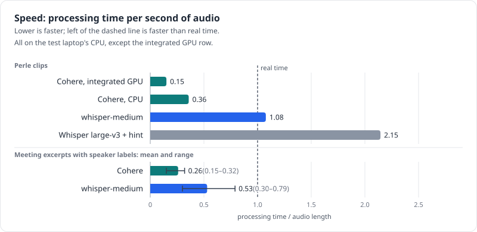

# Command line

`transcribe.py` is the transcriber that the app runs for local models, and it works on its own. It
runs offline. Commands below are run from the project folder on Linux; for everyday use, the app is
easier ([the app](09-app.md)).

## Setup

You need Python 3.12 and [uv](https://docs.astral.sh/uv/), plus `curl`. The benchmark scripts also
need `ffmpeg`; the transcriber and the app don't.

```sh
uv venv .venv --python 3.12 && VIRTUAL_ENV=.venv uv pip install -r requirements.txt

# Default engine: the whisper-medium Arabic–English code-switching fine-tune (0.8 GB), plus the
# Whisper tokenizer it needs to run offline
.venv/bin/python bench/fetch_models.py \
  Seif-Eldeen-Sameh/whisper-medium-arabic-codeswitched-ct2:config.json \
  Seif-Eldeen-Sameh/whisper-medium-arabic-codeswitched-ct2:vocabulary.json \
  Seif-Eldeen-Sameh/whisper-medium-arabic-codeswitched-ct2:model.bin
curl -L -o models/whisper-medium-arabic-codeswitched-ct2/tokenizer.json \
  https://huggingface.co/openai/whisper-tiny/resolve/main/tokenizer.json

# Voiceprint model for speaker labels: NVIDIA TitaNet-small (40 MB)
mkdir -p models/diarization && curl -L -o models/diarization/nemo_en_titanet_small.onnx \
  https://github.com/k2-fsa/sherpa-onnx/releases/download/speaker-recongition-models/nemo_en_titanet_small.onnx

# Optional: Cohere Transcribe Arabic (1.6 GB), for --engine cohere
.venv/bin/python bench/fetch_models.py \
  handy-computer/cohere-transcribe-arabic-07-2026-gguf:cohere-transcribe-arabic-07-2026-Q4_K_M.gguf
```

The app can do the downloads instead (*Settings → Models*). Run from source, it
keeps models in the same `models/` folder, so `transcribe.py` finds them there.

Other models:

- Stock Whisper large-v3 (`--whisper-model large-v3`) loads from the Hugging Face cache and is not
  downloaded automatically: `.venv/bin/hf download Systran/faster-whisper-large-v3` (3 GB).
- The other voiceprint models are needed only by `bench/compare_voiceprints.py`, which skips any that
  are missing: `wespeaker_en_voxceleb_resnet34_LM.onnx`, `wespeaker_en_voxceleb_resnet152_LM.onnx`,
  `nemo_en_titanet_large.onnx` and `3dspeaker_speech_campplus_sv_zh_en_16k-common_advanced.onnx`,
  from the same release as TitaNet-small, into `models/diarization/`.
- The Qwen3-ASR family (R2T2, Qwen3-ASR, Audar) needs llama.cpp's server. Unpack
  `llama-b11165-bin-ubuntu-x64.tar.gz` from the
  [llama.cpp releases](https://github.com/ggml-org/llama.cpp/releases/tag/b11165) into `tools/llama/`,
  then `.venv/bin/python bench/fetch_models.py` with no arguments fetches R2T2 and Qwen3-ASR
  (4.7 GB). For Audar: `audarai/Audar-ASR-V1-Turbo:Audar-ASR-V1-Turbo-Q4_K_M.gguf` and
  `audarai/Audar-ASR-V1-Turbo:mmproj-Audar-ASR-V1-Turbo.gguf`.

## Transcribe a call with speaker labels

```sh
.venv/bin/python transcribe.py path/to/call.wav --speakers 2
```

It prints the transcript and saves it in `results/poc/` as `<file>.<model>.speakers.txt`, `.json`
(start, end, speaker and text for each line) and `.meta.json` (settings, speed, peak memory, start
and finish times, the input file's format under `source`, and this computer under `machine`: maker
and model, operating system, processor, threads, memory). With Whisper it also writes
`.words.json`, with every word's time and speaker. Partial results are
written after every chunk, so a crash or a kill hours into a long recording keeps what was done.
Any audio or video format that FFmpeg reads will do.

| Option | Meaning |
|---|---|
| `--speakers N` | label speakers by voice; give the real number of people, or `0` to estimate it. Leave it out for no labels |
| `--engine whisper` (default) | faster-whisper, int8 on the CPU. The default model is the whisper-medium Arabic–English code-switching fine-tune |
| `--whisper-model large-v3` | stock Whisper large-v3 instead, which then gets the Egyptian style hint automatically. Also takes a folder, such as `models/faster-whisper-large-v3` |
| `--engine cohere` | Cohere Transcribe Arabic through transcribe.cpp, in the same process. Fewest errors on Arabic words, about 3 times faster than real time, no word timestamps |
| `--cohere-model FILE` | another Cohere Transcribe GGUF |
| `--engine llama --port 8081` | R2T2, Qwen3-ASR or Audar through a local llama-server; start it first with `THREADS=8 bench/serve.sh audar 8081` |
| `--prompt TEXT` | a style or vocabulary hint for Whisper (`''` turns off the large-v3 default). Adding a team's jargon is plausible but untested: the one hint measured helped stock large-v3 a lot and the fine-tune not at all |
| `--voiceprint-model FILE` | another speaker-embedding ONNX model for `--speakers` |
| `--language ar` | the default. `en` also works, and `auto` lets Whisper and the llama-server models detect the language. Cohere can't detect it, so `auto` means Arabic there |
| `--threads N` | CPU threads (default 10) |
| `--device auto` | the default: use a graphics card when one works, else the CPU (see [GPU](#gpu)). `cpu` never touches the GPU; `gpu` stops with an error instead of falling back |
| `--cuda-libs DIR` | a folder with NVIDIA's cuBLAS, for Whisper on an NVIDIA GPU (default: `models/nvidia-cuda`, where the app puts it, or the `nvidia-cublas-cu12` pip package) |
| `--gpu-info` | print the GPUs the engines can use, as JSON, and exit |
| `--align MODEL_DIR` | Cohere and llama engines: forced-align the text to get word times (experimental, [below](#forced-alignment-experimental)) |
| `--out DIR` | output folder |
| `--progress-file FILE` | keep a small JSON file updated with the current stage and chunk count (the app uses this) |

The llama engines run like this:

```sh
THREADS=8 bench/serve.sh audar 8081          # or r2t2, qwen3asr; listens on 127.0.0.1 only
.venv/bin/python transcribe.py call.wav --engine llama --port 8081 --speakers 2
```

## GPU

Cohere runs on a graphics card through transcribe.cpp, which reaches NVIDIA, AMD and Intel GPUs
through Vulkan; the Vulkan backend is part of the transcribe.cpp package, so nothing extra is needed
besides the graphics driver. With several GPUs, a discrete one is used before an integrated one. On
the test laptop's integrated Intel Iris Xe, a 50-second public clip took 0.15× real time against 0.41×
on the CPU in performance mode (0.14× against 0.60× in power-saver mode), with the same text.

The Whisper models use CTranslate2, which runs on NVIDIA GPUs through CUDA but not through Vulkan. It
needs NVIDIA's cuBLAS, which isn't bundled: the app downloads it from NVIDIA's pip packages when it finds
an NVIDIA GPU (about 600 MB, [the app](09-app.md)), and from the command line you can install it with
`pip install nvidia-cublas-cu12` or point `--cuda-libs` at the app's copy. Whisper then runs in
`int8_float16`, or `float16` if that fails.

Each engine checks its GPU on a second of silence before starting. If that fails, or the GPU fails in the
middle of a recording (out of memory, a driver error), the rest is transcribed on the CPU and the
`.meta.json` says so in its `device` field. Voiceprints for speaker labels always run on the CPU, which is
fast enough (a few seconds per 10 minutes).

```sh
.venv/bin/python transcribe.py --gpu-info
{"devices": [{"name": "Intel(R) Iris(R) Xe Graphics (ADL GT2)", "kind": "vulkan", "type": "igpu", ...}], "cuda_devices": 0, "cuda_libs": null}
```

## What happens inside

```
recording ──► Silero VAD ──► chunks ≤ 25 s ──► speech model ──► words + timestamps ─┐
     │                                                                              ├─► "Speaker N: …" lines
     └──────► voiceprint every 0.75 s ──► spectral clustering ──► who speaks when ───┘
```

Safeguards added during testing:

- 0.5 s of silence is added to the end of every chunk, because R2T2 drops the last words otherwise.
- Whisper keeps only its first decoding window, so it can't invent text over trailing silence, and
  doesn't spend time decoding it.
- If Whisper stops early inside a chunk, with more than 2 s of speech left, the rest is transcribed
  separately.
- If Cohere's decoder loops until its length cap, the chunk is split at its quietest point and
  retried.
- Cohere's notes such as `(تأتأة)` ("stutter") are removed.

## Forced alignment (experimental)

Cohere gives no word times, so with `--speakers` its audio is cut wherever the voice changes. With
`--align`, whole chunks are transcribed and the text is then aligned to the audio, so every word
gets a time and its own speaker, as with Whisper ([how it works and how it scored](04-speaker-labels.md#forced-alignment-experimental)).
It needs PyTorch and about 1.3 GB more disk, and on the test meetings it was slower than the default
and used more memory. The aligner model's licence is CC-BY-NC-4.0 (non-commercial use only).

```sh
VIRTUAL_ENV=.venv uv pip install torch --index-url https://download.pytorch.org/whl/cpu
VIRTUAL_ENV=.venv uv pip install transformers uroman \
  "ctc-forced-aligner @ git+https://github.com/MahmoudAshraf97/ctc-forced-aligner@64293cc6d711e57666c4a8b098e9fd93b381fd88"
.venv/bin/python bench/fetch_models.py \
  MahmoudAshraf/mms-300m-1130-forced-aligner:config.json \
  MahmoudAshraf/mms-300m-1130-forced-aligner:preprocessor_config.json \
  MahmoudAshraf/mms-300m-1130-forced-aligner:special_tokens_map.json \
  MahmoudAshraf/mms-300m-1130-forced-aligner:tokenizer_config.json \
  MahmoudAshraf/mms-300m-1130-forced-aligner:vocab.json \
  MahmoudAshraf/mms-300m-1130-forced-aligner:model.safetensors

.venv/bin/python transcribe.py meeting.wav --engine cohere --speakers 3 \
  --align models/mms-300m-1130-forced-aligner
```

This was tested with torch 2.14.0 (CPU build), transformers 5.17.0, uroman 1.3.1.1 and
ctc-forced-aligner 0.3.0 at the commit above, on Linux only. The output files get `-aligned` in their
names, so they sit next to a normal run instead of replacing it.

## Speed and memory on the test laptop (performance power mode)

| Model | Measured | Processing time per minute of audio |
|---|---|---|
| Cohere Transcribe Arabic + speaker labels | six 10-minute meeting excerpts: 0.15–0.32× real time (mean 0.26×); the 16-minute call 0.37× (first voiceprint model); 3.0–3.1 GB peak | about 0.3 min |
| whisper-medium fine-tune + speaker labels | six 10-minute meeting excerpts: 0.30–0.79× real time (mean 0.53×); the 2-minute call 0.57× plain and 0.59× with labels; 2.1–3.3 GB peak. Before the review fixes the 16-minute call ran at 1.80× | about 0.5–0.8 min |
| Whisper large-v3 + hint | Perle clips 1.4–2.2× (short clips, no speaker labels) | about 1.5–2 min |
| Also tried: Qwen3-ASR, R2T2, Audar (llama.cpp, no speaker labels) | Perle clips 0.6–0.8×; the 2-minute call 1.4–1.8× in power-saver mode | about 0.6–0.8 min |



*Processing time divided by audio length on the test laptop: the short Perle clips per model, and the meeting excerpts with speaker labels (mean and range).*

Meeting and call speeds count the whole recording, pauses included. On short clips the fixed cost
per chunk weighs more (whisper-medium ran at 1.08× on Perle). An 80-minute call therefore takes
roughly 25 minutes with Cohere and 40–60 minutes with the default on the test laptop's CPU, and several times
longer in power-saver mode (Whisper large-v3 ran at 6.4× real time in power-saver mode against
1.4–2.4× in performance mode, on runs with different settings). A GPU or a hosted service would
bring that down to minutes.

## Benchmark

```sh
.venv/bin/python bench/prepare_data.py perle arzen            # public test sets into data/ (pinned samples)
SET=perle sh bench/run_configs.sh cohere:wav16k:ar whisper:g711:ar large-v3:phone:ar
.venv/bin/python bench/score.py --tables docs/results-tables.md
.venv/bin/python docs/charts.py                                  # redraws the charts in the docs
.venv/bin/python bench/score.py --compare results/A.jsonl results/B.jsonl   # paired WER difference
```

As in `transcribe.py`, large-v3 gets the Egyptian style hint automatically. Results already in
`results/` are skipped, so the command above only fills in what is missing.

Private meeting recordings with reference transcripts (the expected layout is described in
`bench/prepare_private_meetings.py`) are cut into 10-minute excerpts, transcribed with
`transcribe.py`, then scored. For each excerpt `mK`, `N` is its `n_speakers` in
`data/private-meetings/manifest.jsonl`:

```sh
.venv/bin/python bench/prepare_private_meetings.py /path/to/dataset          # into data/private-meetings/
.venv/bin/python transcribe.py data/private-meetings/mK.wav --speakers N --out results/meetings/whisper
.venv/bin/python transcribe.py data/private-meetings/mK.wav --engine cohere --speakers N \
  --out results/meetings/cohere-titanet
.venv/bin/python transcribe.py data/private-meetings/mK.wav --engine cohere --out results/meetings/cohere-plain
.venv/bin/python bench/score_meetings.py        # scores every folder in results/meetings/ as one engine
.venv/bin/python bench/compare_voiceprints.py   # relabels the whisper words with each voiceprint model
```

Their audio, transcripts and results stay in the git-ignored `data/` and `results/meetings/`.

## Files

| Path | Role |
|---|---|
| `transcribe.py` | the command line: engines, chunking, gap-fill, speaker attribution, checkpoints |
| `speakers.py` | voice-based speaker separation |
| `sysinfo.py` | this computer and the input file's format, for the `.meta.json` (the app uses it too) |
| `align.py` | forced alignment for engines without word times (experimental) |
| `bench/serve.sh` | starts llama-server (127.0.0.1 only) for r2t2, qwen3asr or audar |
| `bench/prepare_data.py`, `run_bench.py`, `run_configs.sh`, `score.py` | the public-set benchmark |
| `bench/prepare_private_meetings.py`, `score_meetings.py`, `eval_meetings.py`, `compare_voiceprints.py` | scoring on private meetings with reference transcripts (data and results stay git-ignored) |
| `bench/fetch_models.py` | resumable, checksum-verified model downloader (`bench/run_bench.py --device gpu` benchmarks on the GPU) |
| `bench/samples/` | the pinned clip lists of the public test sets |
| `tests/` | unit tests (`.venv/bin/python -m unittest discover -s tests -v`) |
