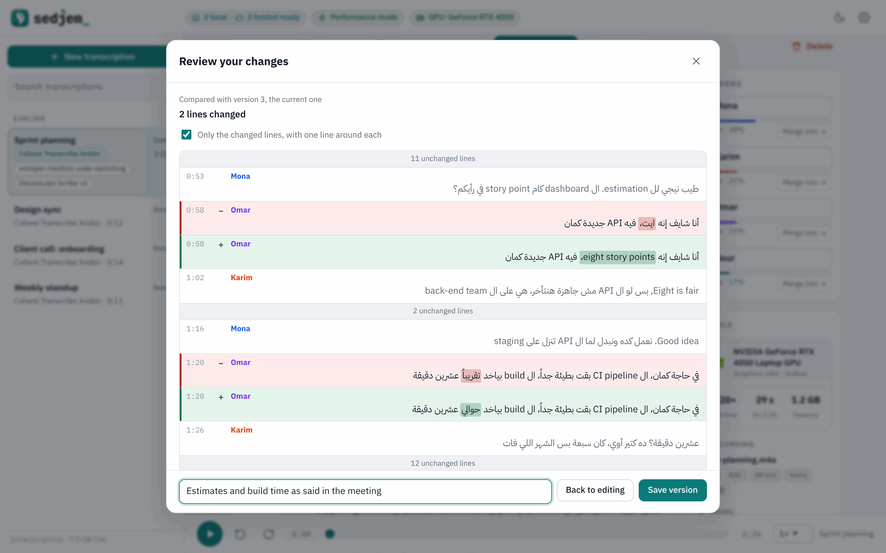
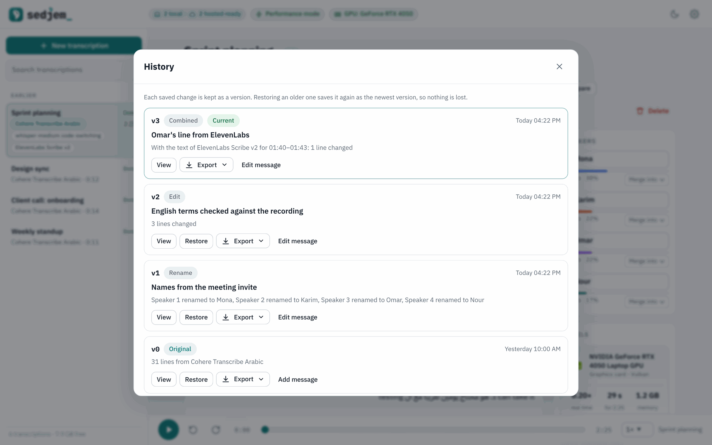

# The app: Sedjem

Sedjem is a local web app for everyday use of the models the project tested. You drop in a recording and
pick a model, and you get a transcript with speaker labels that you can play back, search, correct
and export.

```sh
./app.sh                      # starts it and opens http://127.0.0.1:8765 in the browser
./app.sh --no-browser         # starts the server only
./app.sh --desktop            # opens it in a window of its own (see the desktop notes)
./app.sh --install-launcher   # optional: adds Sedjem to the desktop's application menu
```

Stop it with Ctrl+C in the terminal or with *Quit Sedjem* at the bottom of *Settings*. Starting it
again while it runs just opens the page. It can also be built as a Windows or Linux desktop app
([desktop app](10-desktop.md)).

Local models that aren't on the computer yet can be downloaded from the app, from the model's card
or from *Settings → Models*. Downloads resume after a dropped connection and are checked against a
pinned checksum.

*Settings* has five tabs. *Models* lists the models on the computer, with their downloads and
removal. *Add models* has two views: *Recommended* and *From Hugging Face*. *Hosted services* holds
the API keys, *Speed* the graphics card, power mode and processor threads, and *About* the version,
the licence and the folder where the app keeps its data.

Each model or service in *Models*, *Recommended* and *Hosted services* has a line of key facts under
its name: who made it, the engine, the licence and which graphics cards it can use, or for a service
the provider, the API model, the hourly price and what it does with your audio. Clicking the row, or
its arrow, opens everything known about it: the Hugging Face repository and pinned revision its files
come from, the file, the sizes, whether it runs on the graphics card on this computer, the project's
measured results where there are any, and for a service its privacy terms, key and region. Values the
app doesn't have are shown as not stated.

## What it does

It takes any recording, audio or video (mp3, m4a, wav, ogg, opus, flac, mp4, mkv, webm and more),
dragged in or chosen, or a path to a file already on the computer, which is read in place without a
copy. Each recording is converted once to 16 kHz mono FLAC (about 50 MB per hour), which all the
models and the player use. The uploaded original is then deleted unless `keep_original = true`.

Each model is shown with its strengths (see below). Local ones run through
`transcribe.py`. Hosted ones upload the recording only after you tick a confirmation box.
Speaker labels can be off, estimated, or set to the number of people.

While a local model works you see the stage, a progress bar with the time left, and the transcript
growing chunk by chunk. You can cancel at any time, and a cancelled hosted job is deleted on the
service too.

In the transcript, clicking a timestamp plays from there, and the line being played is highlighted
and followed. Search highlights the matches. You can rename speakers (Speaker 1 becomes a name),
merge two speakers that the model split, edit the text, change a line's speaker, and run the same
audio again with another model to compare (the runs share one audio file, so this takes no extra
space).

Exports are plain text, SRT and WebVTT subtitles, Markdown and JSON, with your names and edits
applied, or you can copy the text. Arabic lines are laid out right to left automatically. There are
light and dark themes, the layout works in a narrow window, and the page loads nothing from outside
(no CDN, web fonts or analytics).

Each transcription keeps a record of how it was made: the recording (name, format, codec, sample
rate, channels, bit rate, size, length), the model (its engine and file, or the service and API
model), the run (processor or graphics card, power mode, threads, times, speed, peak memory, app
version) and the computer (maker and model, operating system, processor, memory, graphics cards).
The *Details* panel shows the main lines, with the makers' logos next to the hardware and the
system, *More details* the rest, and *Copy details* copies all of it. The exports carry it too:
plain text starts with a short header, WebVTT with a `NOTE`, Markdown ends with a Details section
and JSON has a `details` object. SRT has no place for comments and stays as it was. Transcriptions
made before this was added show fewer details. In the text, subtitle and Markdown exports, a line
that is mostly Arabic starts with a right-to-left mark, so players and editors show it right to
left even when it begins with an English word.

## Version history

Every transcript keeps its versions, as version control does. Version 0 is what the model wrote and
never changes. Each saved change after that is a new version (1, 2, and so on), and *History* (or the
`v3` next to the title) lists them, newest first, with the time, the kind of change, your message if
you gave one, and an automatic summary such as "3 lines changed, Speaker 1 renamed to Mona".

- **Edit mode.** Everything done between *Edit* and *Done editing* (the text of lines, a line's
  speaker, names, merges, the title) becomes one version. Before it is saved, *Review your changes*
  shows it the way `git diff` does: each changed line as it was in red and as it is now in green,
  the changed words marked, with one unchanged line around each change. The message is optional,
  and Enter saves.
- **Quick changes.** Outside edit mode, renaming a speaker, merging two and changing the title are
  saved at once with an automatic summary. Quick changes made within two minutes of each other,
  none with a message, are kept as one version.
- **View** shows a version and what changed from the version before it, or from any other version.
  **Restore** makes an older version the newest one again, and the versions in between stay.
  **Export** and **Copy text** there give that version; the rest of the app uses the newest one. A
  message can be added to any version, or changed, later.

A transcription made before the history existed gets one the first time it is opened. Version 0 is
rebuilt from the model's own output (`engine/` for a local model, `hosted.json` for a hosted one)
and version 1 holds the edits made until then. If the model's output is gone, version 0 says so and
starts from the transcript as it was. Changes made to the files outside the app are saved as a
version of their own the next time the transcript is opened.

The versions are kept in the transcription's folder under `history/`: `index.json` lists them, and
each version is one file with its title, speaker names and lines. The newest version is also in
`transcript.json` and `job.json`, where the rest of the app reads it. The code is in
`app/history.py`.

<table>
  <tr>
    <td width="50%"></td>
    <td width="50%"></td>
  </tr>
</table>

For scripts: `GET /api/jobs/<id>/versions` lists the versions, `GET /api/jobs/<id>/versions/<n>`
returns one with its changes (`?against=<m>` compares it with another), `PATCH` on that path with
`{"message": …}` sets its message, and `POST /api/jobs/<id>/versions/<n>/restore` restores it.
`POST /api/jobs/<id>/diff` takes the same body as `PATCH /api/jobs/<id>` and returns what it would
change, without saving. `PATCH /api/jobs/<id>` also takes a `message`, and the exports take
`?version=<n>`.

## Comparing and combining transcripts

A recording is often run with more than one model. The transcriptions of one recording are shown
together: once in the sidebar, with a small label for each model, and as a row of labels under the
title of each of them, so you can switch between them. Transcriptions count as one recording when
one was made from the other with *Run again with*, or when their audio is the same. The app keeps a
fingerprint of the decoded audio of each transcription to tell, so the same file added twice is
grouped as well. For transcriptions made before this was added, the fingerprint is worked out in the
background the first time the list is shown.

*Compare* opens two of them side by side, and *Add a transcript* adds a third. The lines are put in
rows by time, so each row holds what every model wrote for the same stretch of the recording. Words
that differ are marked: strongly when no other model has them, lightly when only some do. Punctuation,
case, diacritics and the usual spelling variants (أ and ا, ة and ه, ى and ي) are not counted as
differences. *Only rows that differ* hides the rest, and clicking a row plays it. Each model numbers
the speakers its own way, so the other columns' speakers are matched to the first column's by who is
talking at the same time. The match can be changed in the Speakers panel.

The first column is the base. To make your own version, press *Keep* in the rows where another model
got it right, or give a time range (from 1:05 to 2:30, say) and the model to take it from. Shift
with *Keep* takes every row from the last one kept in that column. Where the picks overlap, the later
one wins, and everywhere else the base's text stays. A line is taken or left whole, by where its
middle falls. *Use as base* makes another column the base.

*Save as a new version* shows the change first, the same way an edit is reviewed, with an optional
message. It is saved as a new version of the base transcript, so it shows in that transcript's
History as a version of kind "Combined", with a summary of what came from where (for example "With
the text of ElevenLabs Scribe v2 for 00:03 to 00:07: 1 line changed"). Version 0 is still the
model's output, the other transcriptions are not changed, and restoring an earlier version undoes the
combination. Speakers keep the base's numbers and names; a speaker the base does not have keeps the
name it had in its own transcript. The code is in `app/compare.py` and `app/static/compare.js`.

For scripts: `GET /api/jobs/<id>/group` lists the transcriptions of a recording, and `GET
/api/jobs` gives each one a `group`. `GET /api/compare?ids=<a>,<b>[,<c>]&base=<a>` returns the rows.
`POST /api/combine` with `{"ids": […], "base": …, "picks": [{"start", "end", "from"}], "speakers":
{…}, "message": …}` saves the combination, and `POST /api/combine/preview` with the same body returns
what it would change, without saving.

## The models and their settings

All model settings live in [`app/config.toml`](../app/config.toml). Each `[[models]]` entry has an
`id`, a `kind` (`local` or `hosted`), the engine settings and the text the app shows.

| Model | Kind | Best for | Settings |
|---|---|---|---|
| whisper-medium code-switching (default) | local | keeping English terms in English (90% on the public set, 57% on the test meetings) | `whisper_model` folder; accepts a vocabulary hint |
| Cohere Transcribe Arabic | local | Arabic-heavy meetings; the fewest Arabic-word errors; the fastest (about 0.3× real time) | `cohere_model` GGUF path |
| Whisper large-v3 + hint | local | stock Whisper (slow on the test laptop) | `whisper_model = "large-v3"`; gets the Egyptian style hint, and your terms are added to it |
| ElevenLabs Scribe | hosted | minutes people rely on; the best published result for Egyptian–English | `api_model = "scribe_v2"`, `tag_audio_events`, `delete_after`, API key |
| OpenAI | hosted | keeping no copy of the audio; `gpt-transcribe` is told to expect Arabic and English | `api_model`, `diarize_model` (for speaker labels), `carry_speakers`, upload settings, API key |
| Groq Whisper large-v3 | hosted | stock Whisper with the Egyptian hint; a free plan of 8 h of audio a day | `api_model` (large-v3 or turbo), upload settings, API key |
| Mistral Voxtral | hosted | Voxtral Mini Transcribe 2, with speaker labels | `api_model`, upload settings, API key |
| Speechmatics | hosted | its Arabic–English bilingual pack (`ar_en`); doesn't train on your audio | `language`, `api_model` (enhanced or standard), `speaker_sensitivity`, `base_url` region, `delete_after`, API key |
| Google Gemini | hosted | Gemini 3.5 Transcribe, which follows Arabic–English code-switching; free tier (which trains on your audio) | `api_model`, `language_codes`, `max_minutes`, `inline_limit_mb`, `delete_after`, API key |
| Deepgram Nova-3 | hosted | fast Arabic-only transcripts (`ar-EG`); the app opts out of training | `api_model`, `language`, `diarize_model`, `mip_opt_out`, API key |
| AssemblyAI | hosted | Universal-3.5 Pro, which follows code-switching | `speech_models`, `expected_languages`, `base_url` (US or EU), `delete_after`, API key |
| Azure AI Speech | hosted | the `ar-EG` locale; Microsoft stores nothing | region (in *Settings → Hosted services*), `locale`, `max_speakers`, `max_minutes`, `endpoint`, API key |

The other sections are `[server]` (host and port; keep it on 127.0.0.1), `[storage]` (the data
folder, whether to keep the original, the upload limit), `[defaults]` (model, speakers, language)
and `[local]` (Python, CPU threads, voiceprint model, `performance_while_running`). Personal
overrides go in `app_data/config.toml` with the same layout, so `app/config.toml` can stay as
shipped. A `[[models]]` entry there with the same `id` changes only the fields it lists, and
`disabled = true` hides a model.

### Models from Hugging Face

*Settings → Add models → From Hugging Face* adds a model from Hugging Face. Paste the link to the
model's page or to one of its files, or its name (`org/name`), and choose *Check*. Sedjem reads the
model's file list from the Hugging Face API, without logging in, and shows the kind of model, its
family, the file, the size, the licence and the revision. *Add and download* saves it and downloads
it like the built-in models. It then has a card of its own, marked *From Hugging Face*, and *Remove
from the app* deletes it and its files.

*Settings → Add models → Recommended* lists the models worth trying for these meetings, from
[`app/catalog.toml`](../app/catalog.toml): the three built-in ones, Cohere at higher precision,
the Egyptian code-switching whisper-small, and Whisper large-v3 and large-v3-turbo, in GGUF for any
graphics card and for faster-whisper. Each entry gives what it is good for, the evidence (the
figures from the project's tests, or *Not tested by the project*), the download size, the licence
and which graphics cards it can use, and adds the model in one click, pinned to the revision in the file. Whisper
models in GGUF take a vocabulary like the faster-whisper ones, and large-v3 gets the Egyptian style hint
before it; large-v3-turbo gets only your terms, since the hint was measured on large-v3 alone.

| Kind | What the repository has | How it runs |
|---|---|---|
| faster-whisper | `model.bin`, `config.json` and `vocabulary.json` (or `.txt`): Whisper converted to CTranslate2 | like whisper-medium; the pinned Whisper tokenizer is added if the model has none, so it runs offline |
| GGUF | `.gguf` files of a family transcribe.cpp runs: whisper, cohere_asr, parakeet, canary, moonshine, qwen3_asr, granite_speech, voxtral, sensevoice and a few more | like Cohere (`engine = "gguf"`); the family is read from the file's header before anything is downloaded |
| Transformers | a Whisper checkpoint: `config.json` with `"model_type": "whisper"`, and `.safetensors` or `pytorch_model.bin` | converted to CTranslate2 (float16) after the download, then like faster-whisper |

When a repository has several GGUF files, Sedjem picks Q4_K_M (else Q5_K_M, Q8_0 or the smallest),
and the others can be chosen from a list. A GGUF family that doesn't take a language setting runs
without one. Converting a Transformers checkpoint needs the `transformers` and `torch` packages. A
source installation can have them (`pip install transformers torch`), but the desktop build
doesn't, and Sedjem then says so; a faster-whisper version of the same model avoids the conversion.
Gated and private repositories, language models in GGUF, adapters (LoRA) and other model types are
refused with the reason.

Each file is pinned to the commit that was checked, and verified after the download: large files by
the SHA-256 that Hugging Face lists, small ones by their git blob id. The entries are saved in
`app_data/models.json`, and the files go to `models/hf/<org>--<name>/`. The speed shown at first is
estimated from the file size; after the first run on a recording of a minute or more, the measured
speed is used. For scripts: `POST /api/hub/inspect` with `{"url", "file"}` shows what a link holds
without saving anything, `POST /api/hub/add` with the same fields adds the model and starts the
download, and `DELETE /api/models/<id>` removes an added model.

### Gemini, Deepgram, AssemblyAI and Azure Speech

These run through `app/hosted_more.py`. Their keys are entered in *Settings → Hosted services* like
the others, or set in `GEMINI_API_KEY`, `DEEPGRAM_API_KEY`, `ASSEMBLYAI_API_KEY` or
`AZURE_SPEECH_KEY`. An Azure key works only in the region of its Speech resource, so Azure's key
form also has a region field. The region is saved with the key in `secrets.json`;
`AZURE_SPEECH_REGION` overrides it, and `region` in the config is the default (`westeurope`). None
of the four has been measured on Egyptian speech by the project.

- **Gemini** ([keys](https://aistudio.google.com/apikey)) uses `gemini-3.5-transcribe` through the
  Interactions API, with `store: false` so Google doesn't keep the request. The app asks for verbatim
  text with word times and speaker labels when they are on (up to 8; three or more is experimental).
  For Arabic + English it sends no `language_codes`, so the model detects the language, which its
  guide says is how it follows code-switching. With word times one request takes at most 30 minutes, so
  longer recordings go in parts of up to 29 minutes, each cut at the quietest moment of its last two
  minutes. Speaker numbers restart in every part, so merge them in the transcript. A part too large
  for a 20 MB request is uploaded with the Files API and deleted after it is transcribed. The model
  can't combine key terms with word times, so it gets no vocabulary. With a general model in
  `api_model` (for example `gemini-3.8-flash`), the app sends instructions instead (Egyptian Arabic as
  spoken, English terms in Latin script, your terms if `prompt = true`) and a JSON schema for segments
  with start, end, speaker and text; those times come from the model and are less exact. The free
  tier costs nothing, but Google uses what you send to improve its products and human reviewers may
  read it, except for users in the EEA, Switzerland and the UK. With billing on it isn't used, and the
  price is about $0.30 an hour ($2 per million audio tokens in, $12 per million text tokens out).
- **Deepgram** ([keys](https://console.deepgram.com/)) gets the audio as the body of one request to
  `/v1/listen` with `model=nova-3`, `language=ar-EG`, `smart_format`, `utterances`, `diarize_model=latest`
  for speaker labels (`diarize=true` is deprecated), your terms as `keyterm` (up to 100) and
  `mip_opt_out=true`, which keeps the audio out of Deepgram's model training. Nova-3 has 17 Arabic
  codes, but its code-switching mode (`language=multi`) doesn't include Arabic, and with one language
  set it transcribes only that language, so English terms may come out in Arabic letters or be
  dropped. It can't detect Arabic, so auto-detect also sends `ar-EG`. There is $200 of free credit,
  then $0.0043 a minute ($0.26 an hour) with speaker labels included, and $0.0013 a minute more with
  key terms. Deepgram stores no transcripts.
- **AssemblyAI** ([dashboard](https://www.assemblyai.com/dashboard/home)) gets the audio through
  `/v2/upload`, then a transcript request with Universal-3.5 Pro (Universal-2 as the fallback),
  language detection expecting `ar` and `en` (how Universal-3.5 Pro follows switches between
  languages), `speaker_labels`, `speakers_expected` when you give the number (it is taken as exact)
  and your terms as `keyterms_prompt`. The app polls until it is done, then deletes the transcript,
  which also deletes the uploaded audio. After a cancel it deletes it at once or, if AssemblyAI
  refuses while the job runs, tries again every 30 seconds while the app is open. New accounts get
  $50 (up to 185 hours), then it costs $0.21 an hour, $0.02 more with speaker labels and $0.05 more
  with key terms. AssemblyAI may train on the audio; free accounts can't opt out, paid ones can under
  *Data controls*. Its data page says audio sent to the EU endpoint
  (`base_url = "https://api.eu.assemblyai.com"`) isn't used for training.
- **Azure AI Speech** ([portal](https://portal.azure.com/), *Keys and Endpoint* of the Speech resource)
  uses fast transcription: one multipart request to
  `https://<region>.api.cognitive.microsoft.com/speechtotext/transcriptions:transcribe?api-version=2025-10-15`
  with the key in `Ocp-Apim-Subscription-Key`, the audio, and a definition with `locales: ["ar-EG"]`,
  `diarization` (`maxSpeakers` is your number, or 10 for auto-detect; it must be 2 to 35) and
  `profanityFilterMode: "None"`. With one locale it transcribes that language, with several it picks
  one for the whole file, and its multilingual model has no Arabic, so there is no code-switching.
  Microsoft doesn't store audio or transcripts from fast transcription. It costs $0.36 an hour and
  isn't part of the free (F0) tier. The REST reference allows under 2 hours and 250 MB per request,
  while the how-to guide and the quotas page say under 5 hours and 500 MB, so the app sends parts of
  up to 115 minutes. Fast transcription runs in 22 regions, including `westeurope`, `northeurope`,
  `francecentral`, `italynorth` and `swedencentral`, but not `uaenorth` or `qatarcentral`. Phrase
  lists are off (`prompt = false`), because the language table lists them for `ar-SA` and `en-US`
  but not for `ar-EG`.

These details come from the providers' pages as they were on 25 September 2026: Gemini
[transcribe](https://ai.google.dev/gemini-api/docs/transcribe),
[Interactions API](https://ai.google.dev/gemini-api/docs/interactions) and
[reference](https://ai.google.dev/api/interactions-api), [files](https://ai.google.dev/gemini-api/docs/files),
[audio](https://ai.google.dev/gemini-api/docs/audio),
[structured output](https://ai.google.dev/gemini-api/docs/structured-output),
[models](https://ai.google.dev/gemini-api/docs/models), [pricing](https://ai.google.dev/gemini-api/docs/pricing),
[terms](https://ai.google.dev/gemini-api/terms) and [errors](https://ai.google.dev/gemini-api/docs/api-errors);
Deepgram [pre-recorded](https://developers.deepgram.com/docs/pre-recorded-audio),
[API reference](https://developers.deepgram.com/reference/speech-to-text/listen-pre-recorded),
[languages](https://developers.deepgram.com/docs/models-languages-overview),
[language detection](https://developers.deepgram.com/docs/language-detection),
[diarization](https://developers.deepgram.com/docs/diarization),
[utterances](https://developers.deepgram.com/docs/utterances),
[keyterm](https://developers.deepgram.com/docs/keyterm),
[training opt-out](https://developers.deepgram.com/docs/the-deepgram-model-improvement-partnership-program),
[errors](https://developers.deepgram.com/docs/errors) and [pricing](https://deepgram.com/pricing);
AssemblyAI [models](https://www.assemblyai.com/docs/pre-recorded-audio/select-the-speech-model),
[languages](https://www.assemblyai.com/docs/pre-recorded-audio/supported-languages),
[code switching](https://www.assemblyai.com/docs/pre-recorded-audio/code-switching),
[speaker labels](https://www.assemblyai.com/docs/pre-recorded-audio/label-speakers),
[key terms](https://www.assemblyai.com/docs/pre-recorded-audio/universal-3-5-pro/prompting), the API
reference for [upload](https://www.assemblyai.com/docs/pre-recorded-audio/api-reference/files/upload),
[submit](https://www.assemblyai.com/docs/pre-recorded-audio/api-reference/transcripts/submit) and
[delete](https://www.assemblyai.com/docs/pre-recorded-audio/api-reference/transcripts/delete),
[data and training](https://www.assemblyai.com/docs/data-retention-and-model-training),
[opt-out](https://www.assemblyai.com/docs/faq/how-to-opt-out-of-data-sharing-for-our-model-improvement-program),
[endpoints](https://www.assemblyai.com/docs/pre-recorded-audio/select-the-region),
[file limits](https://www.assemblyai.com/docs/faq/are-there-any-limits-on-file-size-or-file-duration-for-files-submitted-to-the-api),
[billing](https://www.assemblyai.com/docs/billing-and-pricing) and [pricing](https://www.assemblyai.com/pricing);
Azure [fast transcription](https://learn.microsoft.com/azure/ai-services/speech-service/fast-transcription-create),
[REST reference](https://learn.microsoft.com/rest/api/speechtotext/transcriptions/transcribe?view=rest-speechtotext-2025-10-15),
[diarization](https://learn.microsoft.com/azure/ai-services/speech-service/configure-language-identification-diarization),
[regions](https://learn.microsoft.com/azure/ai-services/speech-service/regions?tabs=stt),
[languages](https://learn.microsoft.com/azure/ai-services/speech-service/language-support?tabs=stt),
[phrase lists](https://learn.microsoft.com/azure/ai-services/speech-service/improve-accuracy-phrase-list),
[quotas](https://learn.microsoft.com/azure/ai-services/speech-service/speech-services-quotas-and-limits),
[data privacy](https://learn.microsoft.com/azure/ai-foundry/responsible-ai/speech-service/speech-to-text/data-privacy-security),
the `maxSpeakers` range in the
[SDK reference](https://learn.microsoft.com/python/api/azure-ai-transcription/azure.ai.transcription.models.transcriptiondiarizationoptions),
and the price from the [Azure Retail Prices API](https://prices.azure.com/api/retail/prices), because the
[pricing page](https://azure.microsoft.com/pricing/details/speech/) loads its prices with JavaScript. The
clients were tested against local stand-ins that follow these formats, not against the services.

Not verified: whether a Gemini language hint such as `ar-EG` would do better on code-switched speech
than detection, and what its free tier's limits are (AI Studio shows them); whether Deepgram's `keyterm`
works for Arabic (the page names Nova-3 but no languages) and what the "pricing impacts" of
`mip_opt_out` in its API reference are (the program page names none); whether AssemblyAI deletes a
transcript that is still processing, and whether a key works on its EU endpoint without changes; the
real limit per Azure request (2 or 5 hours) and how English words come out with the `ar-EG` locale.

### API keys

Enter them in *Settings → Hosted services*. Each service has a row there, and its key form opens
only when you choose *Add key* (or *Change*, once a key is saved). Keys are saved to
`app_data/secrets.json` (file mode 600, ignored by git). `ELEVENLABS_API_KEY` or
`SPEECHMATICS_API_KEY` set in the environment takes precedence.

ElevenLabs ([keys](https://elevenlabs.io/app/settings/api-keys)) gives about 4.5 h a month free,
then charges $0.22/h. It may use your audio for training unless you opt out in your profile, under
*Terms and privacy*, then *Data use*. The app sends `diarize`, `num_speakers` (as a maximum),
`language_code` (unless the language is set to detect), and your vocabulary as `keyterms`, each term
up to 5 words; requests with key terms cost about 20% more. With `delete_after`, it deletes the
transcript from your ElevenLabs history once it has been fetched.

Speechmatics ([keys](https://portal.speechmatics.com/settings/api-keys)) gives $100 of free credit
(about 250 h with the enhanced model), then charges $0.40/h. It doesn't train on your audio unless
you opt in and keeps batch data for 7 days; the app deletes the job as soon as the transcript is
fetched. Batch jobs can't be told how many speakers there are, so `speaker_sensitivity` (0 to 1)
sets how readily it splits voices. The default host is the EU region (`eu1`); `us1` and `au1` also
work. Whether the free plan includes the `ar_en` pack isn't documented, and a 403 error would say
it doesn't.

The API details were taken from the official documentation on 25 September 2026. The hosted modes
were tested against a local stand-in for each API (request fields, parsing, cancel, delete), not
against the real services, because no keys were available and no audio was to be uploaded.

### OpenAI, Groq and Mistral

The three have OpenAI-style `/audio/transcriptions` endpoints and share one client,
`app/hosted_openai.py`. Keys come from [OpenAI](https://platform.openai.com/api-keys),
[Groq](https://console.groq.com/keys) and [Mistral](https://console.mistral.ai/api-keys), or from
`OPENAI_API_KEY`, `GROQ_API_KEY` and `MISTRAL_API_KEY` in the environment.

The upload is the recording as Opus in WebM at 32 kbps (about 14 MB an hour instead of 50 MB for the
FLAC), encoded with PyAV, whose FFmpeg has the Opus and MP3 encoders; `upload_format` can also be
`ogg`, `mp3` or `flac`. A recording longer than one request may be (`max_part_mb`, `max_part_s`) is
cut at the quietest moment of the last two minutes before the limit, each part goes in its own
request, and its times get the part's start added. A part that comes out larger than planned is cut
in two again, and stretches that never get louder than -60 dBFS aren't sent. After a 429 with a
Retry-After of a minute or less, a server error or a dropped connection, a part is sent again, five
times in all; a used-up quota fails at once. Cancel works during an upload and between parts. Unlike
ElevenLabs and Speechmatics, none of the three leaves a stored job or transcript that the app could
delete afterwards.

- **OpenAI** uses `gpt-transcribe` ($0.27/h), which takes `languages[]` (the app sends `ar` and
  `en`) and your terms as `keywords[]`. It returns text without times, as do `gpt-4o-transcribe`
  ($0.36/h) and `gpt-4o-mini-transcribe` ($0.18/h), which get the terms as `prompt`; so these are sent
  one stretch of 10 to 25 s at a time (`piece_s`), and each stretch becomes a line. That is 150 to
  360 requests an hour of audio, one after another. With speaker labels on, the app uses
  `gpt-4o-transcribe-diarize` ($0.36/h, `response_format = diarized_json`, `chunking_strategy =
  auto`), which takes no prompt and can't be told the number of people. It gets parts of up to 10
  minutes, because a Tier 1 account (the first paid one) takes 10,000 tokens a minute for this model
  and gpt-4o-transcribe; the 4o models also stop at 2,000 output tokens, and a part whose reply
  reaches that limit is sent again in halves. Each later part is sent 3 to 8 s clips of up to four voices heard so far
  (`known_speaker_names[]` and `known_speaker_references[]` as data URLs), and a voice it recognises
  keeps its number; a fifth voice, or one it doesn't match, gets a new number, so merge those in the
  transcript. `whisper-1` ($0.36/h) returns segments with times and gets the Egyptian style hint as
  for Groq (not measured with it). With `diarize_model = ""`, labels come from the voiceprints on this
  computer instead.
  There is no free tier. OpenAI doesn't train on API data, and for transcriptions it keeps no
  abuse-monitoring logs and no application state.
- **Groq** runs `whisper-large-v3` ($0.111/h; `whisper-large-v3-turbo` costs $0.04/h but is weaker
  on Arabic) with `response_format = verbose_json`, segment timestamps and `language`. The `prompt` is
  the Egyptian style hint that took local large-v3 from 47% to 34% WER on ArzEn, followed by your
  terms, cut to about 200 characters because Whisper prompts are limited to 224 tokens; with the
  language set to English the hint is left out. Segments Whisper itself marks as silence
  (`no_speech_prob` over 0.6 with `avg_logprob` under -1) are dropped. The free plan allows 20
  requests a minute, 2 h of audio an hour, 8 h a day and 25 MB per file (100 MB on the developer
  plan), so parts stay under 24 MB. Groq has no speaker labels; they come from the voiceprints on this
  computer. It keeps no request data by default, but may log requests for up to 30 days to look into
  errors or abuse.
- **Mistral** runs `voxtral-mini-2602` (Voxtral Mini Transcribe 2, $0.18/h) with
  `timestamp_granularities = segment`, `diarize` when labels are on, and up to 100 terms as
  `context_bias`. Its docs say timestamps can't be combined with `language`, so the language is always
  detected, and that context bias is tuned for English. Phrases are sent with underscores for
  spaces, as in the docs' examples (whose replies keep the underscores), and get their spaces back in
  the text. Its limits page says 60 minutes per request and its transcription FAQ about 3 hours, so
  parts are kept to 58 minutes; each part has its own speaker numbers. Mistral may use API data to
  improve its models unless *Anonymous improvement data* is switched off (*Admin*, then *Privacy*).

**Speaker labels from voiceprints.** For a model without speaker labels (Groq, or OpenAI with
`diarize_model = ""`), when labels are on and the voiceprint model is downloaded, the app runs the
voice step of the local models (TitaNet-small voiceprints, spectral clustering) before uploading. It
runs in the model process (`app/worker.py --speaker-timeline`, which prints the timeline as JSON),
and each line gets the speaker of most voiceprint windows within it, so a line that spans a change
of speaker goes to whoever talks most in it. Run once with the real model on six public Perle clips
joined together, the step took 1.3 s and gave each clip its own speaker.

**Checked on 25 September 2026** in the official docs:
[OpenAI's speech-to-text guide](https://developers.openai.com/api/docs/guides/speech-to-text), the
model pages for
[gpt-transcribe](https://developers.openai.com/api/docs/models/gpt-transcribe),
[gpt-4o-transcribe](https://developers.openai.com/api/docs/models/gpt-4o-transcribe),
[gpt-4o-mini-transcribe](https://developers.openai.com/api/docs/models/gpt-4o-mini-transcribe),
[gpt-4o-transcribe-diarize](https://developers.openai.com/api/docs/models/gpt-4o-transcribe-diarize)
and [whisper-1](https://developers.openai.com/api/docs/models/whisper-1),
[pricing](https://developers.openai.com/api/docs/pricing),
[data use](https://developers.openai.com/api/docs/guides/your-data) and
[error codes](https://developers.openai.com/api/docs/guides/error-codes). The API reference pages
didn't load for the fetch tool (platform.openai.com answered 403, and the developers.openai.com page
showed only the examples), so the parameter rules and reply fields come from the
[request](https://github.com/openai/openai-python/blob/main/src/openai/types/audio/transcription_create_params.py)
and reply types in OpenAI's Python SDK, which are generated from its API spec. Groq's
[speech-to-text](https://console.groq.com/docs/speech-to-text),
[API reference](https://console.groq.com/docs/api-reference),
[rate limits](https://console.groq.com/docs/rate-limits) and
[data](https://console.groq.com/docs/your-data) pages. Mistral's
[offline transcription](https://docs.mistral.ai/studio/audio/speech_to_text/offline_transcription)
(with its source in [platform-docs-public](https://github.com/mistralai/platform-docs-public) for the
example requests and replies), [overview](https://docs.mistral.ai/studio/audio/speech_to_text),
[API reference](https://docs.mistral.ai/api/endpoint/audio/transcriptions),
[models](https://docs.mistral.ai/getting-started/models/models_overview/),
[price](https://docs.mistral.ai/models/voxtral-mini-transcribe-26-02),
[limits](https://docs.mistral.ai/resources/known-limitations),
[free mode](https://docs.mistral.ai/getting-started/quickstarts/studio/activate-and-generate-api-key)
and [training opt-out](https://help.mistral.ai/en/articles/455207-can-i-opt-out-of-my-input-or-output-data-being-used-for-training).

**Not verified:** how long a request the 4o models take (only the 2,000 output tokens are
documented; users report about 1,400 to 1,500 s), how many tokens a minute of audio counts for
against the per-minute limit, whether the 2,000 tokens apply per chunk or per request with
`chunking_strategy = auto`, whether the diarize model takes WebM clips as known
speakers (the guide says any upload format; its example is WAV) and how well it matches them, how
many keywords gpt-transcribe takes, whether Groq trains on API data (its data page doesn't say),
which of Mistral's two length limits holds, whether it takes phrases with spaces as context bias,
its error format, whether its free mode includes Voxtral, and the OpenAI key page link (the site
couldn't be fetched). None of the three was measured on Egyptian speech by the project, and the clients were
tested only against local stand-ins (`tests/test_providers_openai.py`: request fields, the file sent,
parts and time offsets, speaker numbers across parts, errors 401, 413 and 429, retries, cancel, and
the voiceprint step with a stand-in model process).

## Privacy

- The server listens on 127.0.0.1 only, answers only requests addressed to that host, and refuses
  changes that don't carry the app's own header, so other websites open in the same browser can't
  use it.
- With local models, nothing leaves the computer.
- Checking or adding a model from Hugging Face asks huggingface.co for that model's details and
  files, and nothing else.
- With hosted models, the recording is uploaded only when you pick one and also tick "Upload this
  recording to …". The server checks this again, including for re-runs. Keys go only to their own
  service.
- Everything the app stores (audio, transcripts, logs, keys) is in `app_data/`, which git ignores.
  Deleting a transcription in the app removes its folder, and deleting `app_data/` removes
  everything.
- The details kept with each transcription name this computer's maker and model, operating system,
  processor, memory and graphics cards. They are only shown to you and written into your exports
  (all but SRT; add `?details=0` to an export's address to leave them out). Nothing sends them anywhere.

## Speed

The app estimates the time from each model's measured speed (`rtf` in the config) and multiplies it
by 3.5 in power-saver mode. On Linux the top bar shows the power profile, *Settings → Speed*
switches it, and `performance_while_running = true` switches it automatically while local jobs run.
Local jobs run one at a time. Hosted jobs have their own queue and don't wait for a local one.

## Files

| Path | Role |
|---|---|
| `app.sh`, `app.cmd` | launchers for Linux and Windows |
| `app/config.toml` | settings and model definitions |
| `app/server.py` | web server and JSON API (Python standard library) |
| `app/jobs.py` | job folders; the prepare (PyAV conversion), queue and run steps; cancel; re-run |
| `app/engines.py` | local runs (`app/worker.py` running `transcribe.py --progress-file`), and the ElevenLabs and Speechmatics clients |
| `app/hosted_more.py` | the Gemini, Deepgram, AssemblyAI and Azure Speech clients, and cutting long recordings at pauses |
| `app/downloads.py` | model downloads, resumable and checked against the pinned size and SHA-256 |
| `app/hosted_openai.py` | the OpenAI, Groq and Mistral clients: the Opus upload, parts cut at pauses, speaker numbers across parts, labels from voiceprints |
| `app/hub.py` | models added from Hugging Face: links, the API, GGUF headers, conversion, `models.json` |
| `app/desktop.py`, `app/selftest.py` | the desktop window and the installation check ([desktop app](10-desktop.md)) |
| `app/transcript.py` | lines from words, and the exports |
| `app/compare.py` | transcriptions of one recording: grouping them, lining them up by time, and combining them into a new version |
| `app/report.py` | the details of each transcription: what a job records, and how the page and the exports word it |
| `sysinfo.py` | this computer and a recording's format (PyAV), for the details and `transcribe.py`'s `.meta.json` |
| `app/static/` | the interface (HTML, CSS and JavaScript, no build step) |
| `tests/` | unit tests: helpers, the API parsers, the HTTP API against mock services, downloads, paths, the details, and the forced-alignment path. `RUN_MODEL_TESTS=1` also runs whisper-medium on a public clip |

Run the tests with `.venv/bin/python -m unittest discover -s tests -v`.

## API for scripts

Every change needs the header `X-Sedjem: 1`.

| Call | What |
|---|---|
| `GET /api/status` | models (ready, or what's missing), defaults, power profile, free space |
| `POST /api/jobs?model=&speakers=&language=&prompt=&title=&name=&confirm_upload=` | the body is the file |
| `POST /api/jobs` with JSON `{"path": …, "model": …, …}` | a file on this computer, read in place |
| `GET /api/jobs`, `GET /api/jobs/<id>` | the list; one job with its lines (partial while it runs), its `details`, and the same as the labelled `detail_groups` the page shows |
| `PATCH /api/jobs/<id>` | `title`, `speaker_names`, `lines`, or `merge: {from, into}` |
| `POST /api/jobs/<id>/cancel`, `POST /api/jobs/<id>/rerun`, `DELETE /api/jobs/<id>` | |
| `GET /api/jobs/<id>/audio`, `GET /api/jobs/<id>/export/{txt,srt,vtt,md,json}` | `?details=0` leaves the details out of an export |

## Limits

- Local transcription runs on the CPU. An hour of audio takes roughly 20 minutes with Cohere and
  30–45 minutes with whisper-medium in performance mode, and several times longer in power-saver
  mode.
- Speaker labels on a meeting of two or three people put about 8–9% of words on the wrong person
  ([speaker labels](04-speaker-labels.md)). Use rename and merge to fix what matters.
- The transcripts are drafts. On the test meetings, the local models differ from ElevenLabs on
  44–49% of words ([results](03-results.md#real-meetings)).
- Stereo recordings are mixed down to mono, so a call recorded with one person per channel doesn't
  get labels from the channels.
