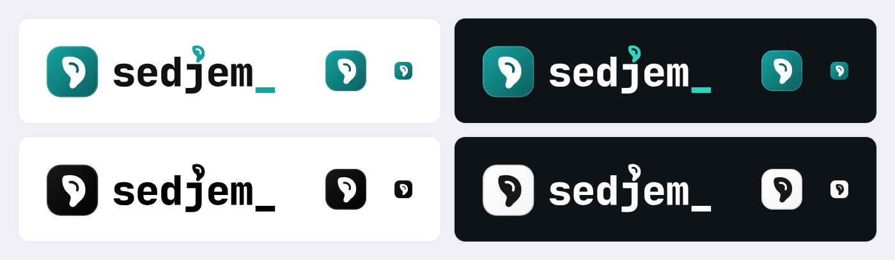

# Sedjem brand

## The idea

Sedjem (sḏm) is the ancient Egyptian verb for "to hear". In hieroglyphs it is written with the sign of an ear. The app does one thing with sound: it listens to a meeting and writes down what it hears. The name and the logo are both built on that idea, going from hearing to text.

The icon is the ear hieroglyph drawn as a modern shape: a single solid ear with one inner curve, on a rounded tile. It uses the teal the app already has (#14a3a1 to #0b5f5e), so the app and its logo belong together.

The wordmark is set in lowercase in a monospace typeface, the kind of letters used for code and plain text, because the app's output is text. Two details carry the idea into the word itself. The dot of the j is replaced by the same ear, so the listening happens inside the name. The underscore at the end is a typing cursor, as if the word is still being written while it is heard. In the colour versions the ear and the cursor are teal and the letters are black or white, so the eye goes from the ear to the cursor, from hearing to writing.

## Versions

There are four versions, each as the full logo (icon and wordmark) and as the wordmark alone.

| Version | Use it on | Letters | Ear dot and cursor | Icon |
|---|---|---|---|---|
| colour | light backgrounds; the main logo | #111111 | #14a3a1 | colour |
| colour-dark | dark backgrounds | #ffffff | #2dd4bf | colour |
| mono-black | one-colour use on light: print, documents, stamps | #000000 | #000000 | mono black |
| mono-white | one-colour use on dark: dark photos and slides | #ffffff | #ffffff | mono white |

The teal is brighter in colour-dark because the normal teal looks dull on black. The mono versions have no teal at all. A one-colour logo stays one colour, including the ear and the cursor.

The icon on its own comes in colour, mono black (black tile, white ear) and mono white (white tile, black ear). The app uses the colour icon (app/static/icon.svg).

## Using it

Keep some space around the logo, at least the height of the letter e on every side. Don't recolour it, stretch it, add effects or put the colour version on a busy photo; use a mono version there instead. Below about 24 pixels high the wordmark gets hard to read, so use the icon alone at small sizes.

## Files

The SVG files in this folder are the originals. The letters in them are outlines, so they look the same everywhere and need no font installed. The png folder has transparent PNGs of each file, the logos and wordmarks at 128 and 512 pixels high and the icons at 256 and 1024.

- sedjem-logo-*.svg: the icon and the wordmark together
- sedjem-wordmark-*.svg: the wordmark alone
- sedjem-icon-*.svg: the icon alone
- brand-sheet.png: the overview above

build.py makes the SVGs from the font and the app's icons, and render.py makes the PNGs and the sheet. To change the logo, edit build.py and run both again, as their docstrings describe.

## Typeface

The wordmark uses JetBrains Mono ExtraBold by JetBrains, released under the SIL Open Font License 1.1, which allows it to be used in a logo. The font itself is not included here.
